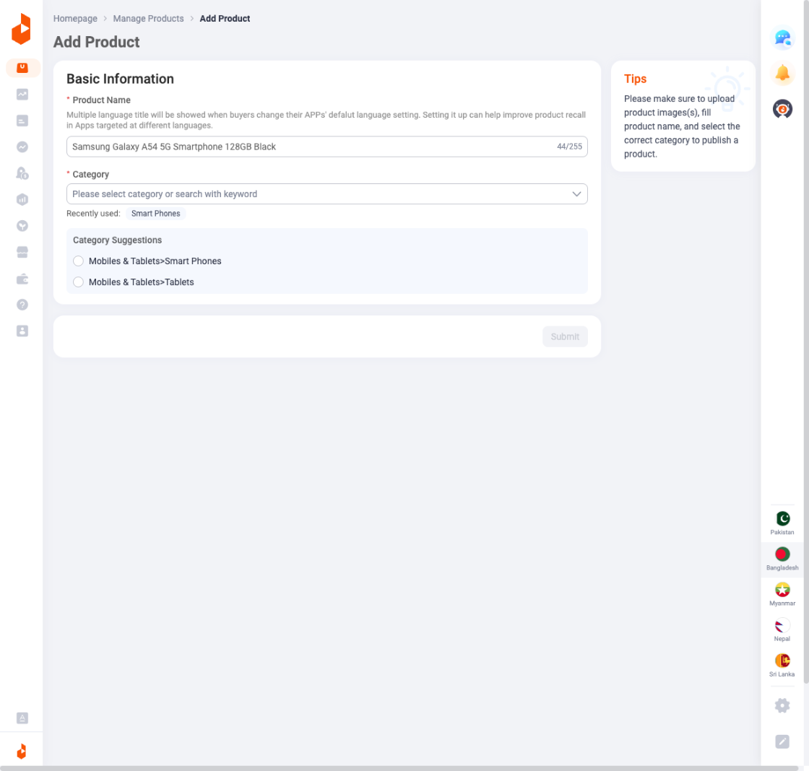
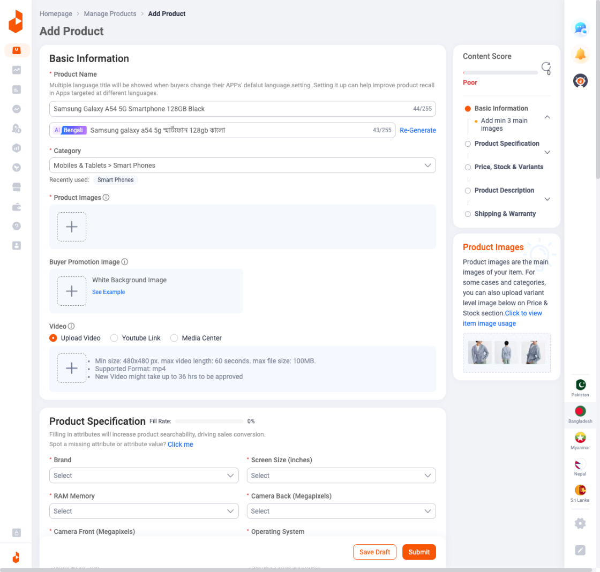
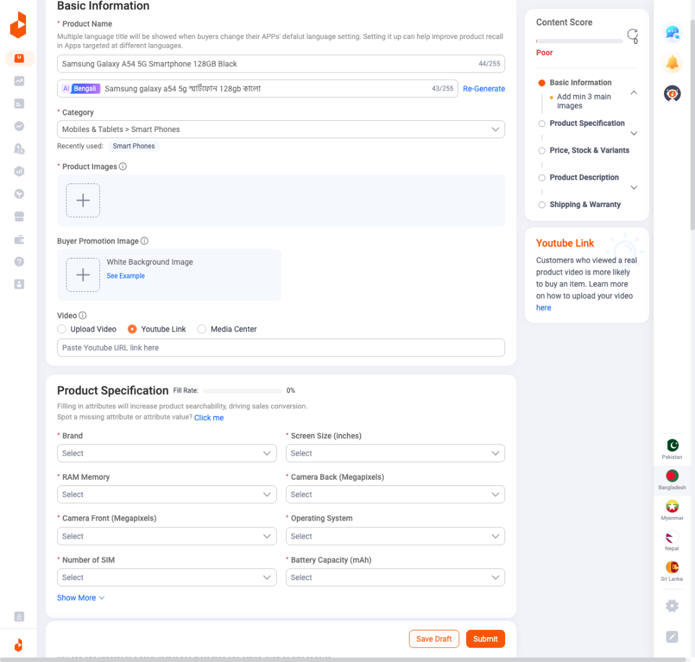
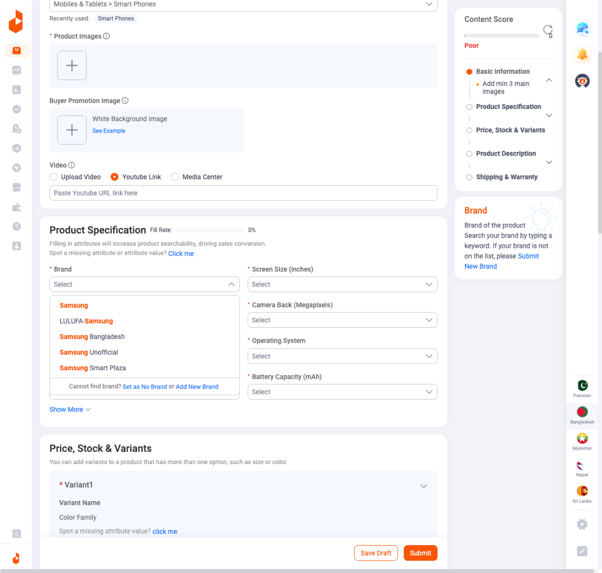
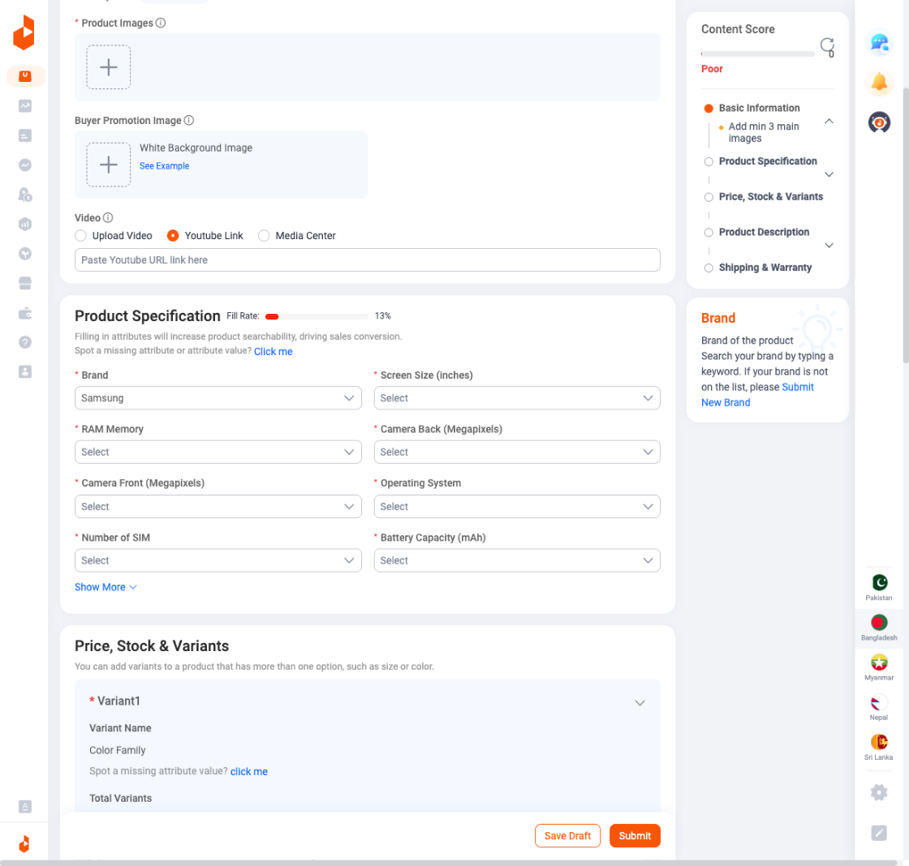
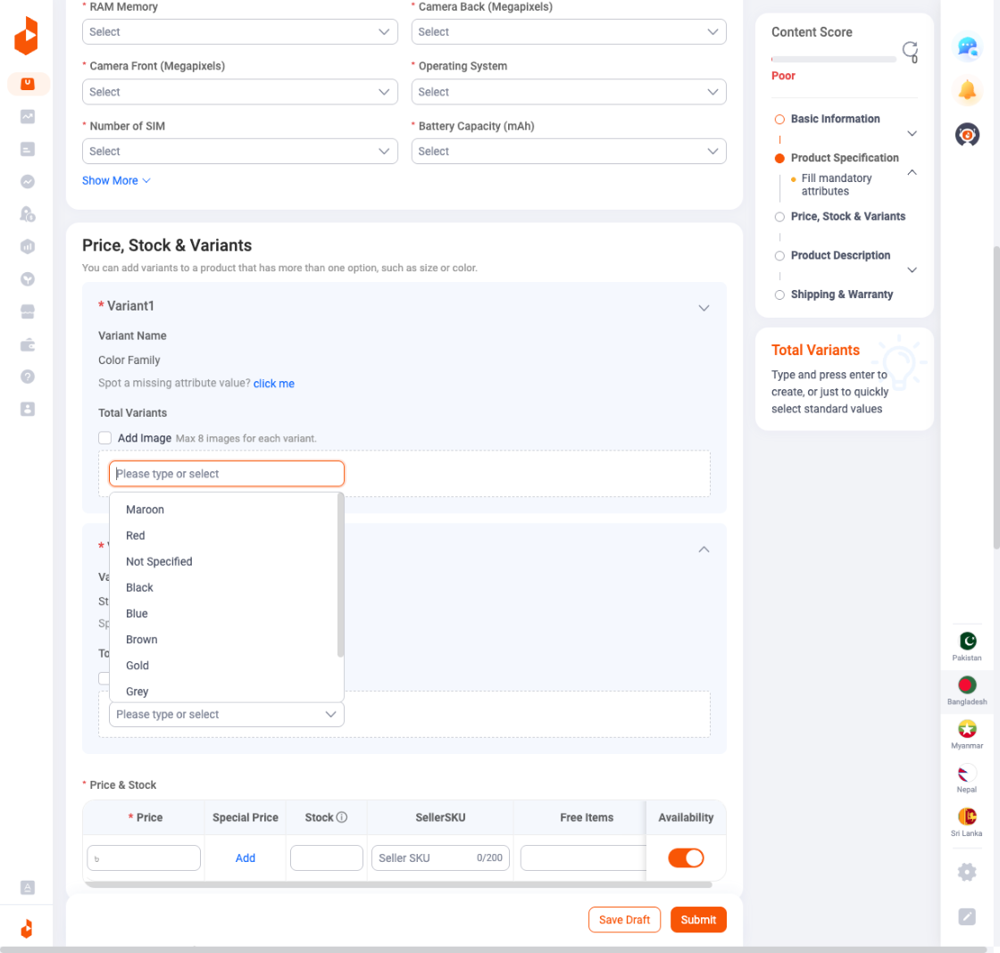
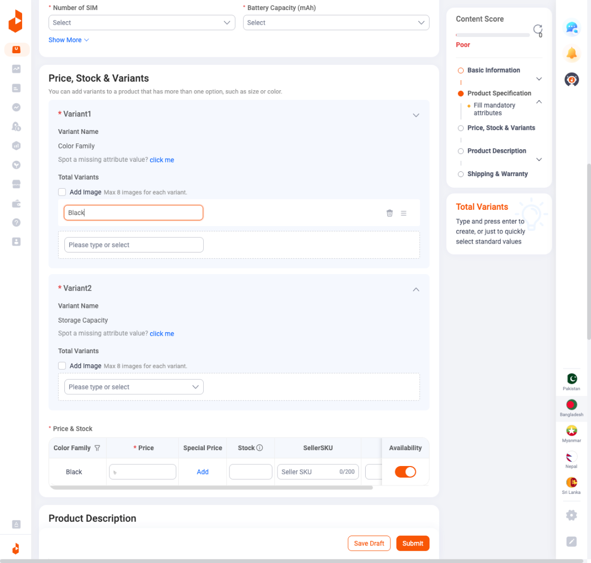
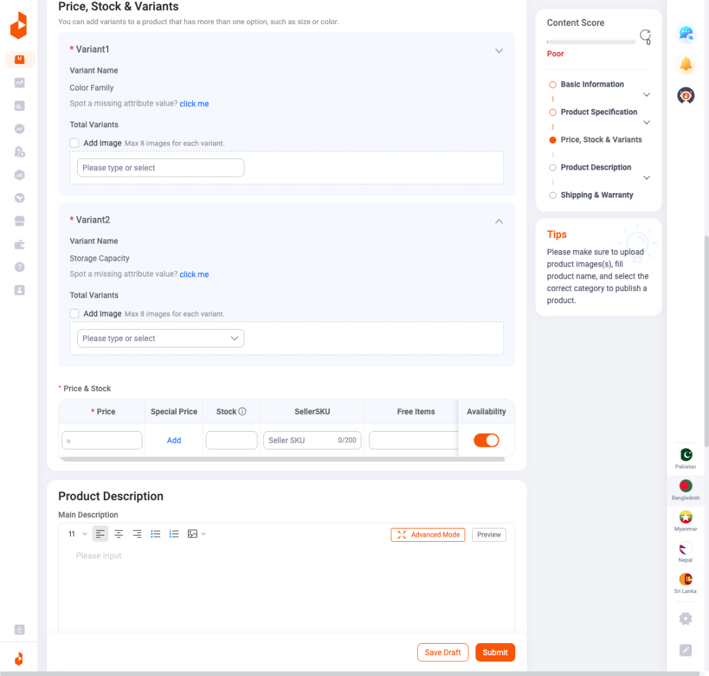
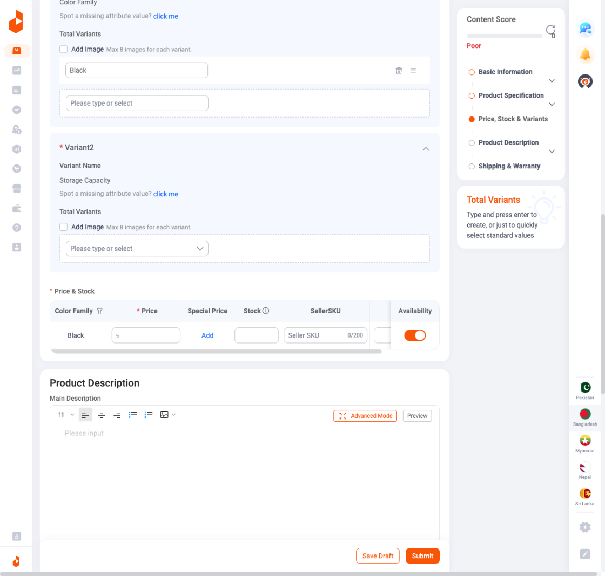
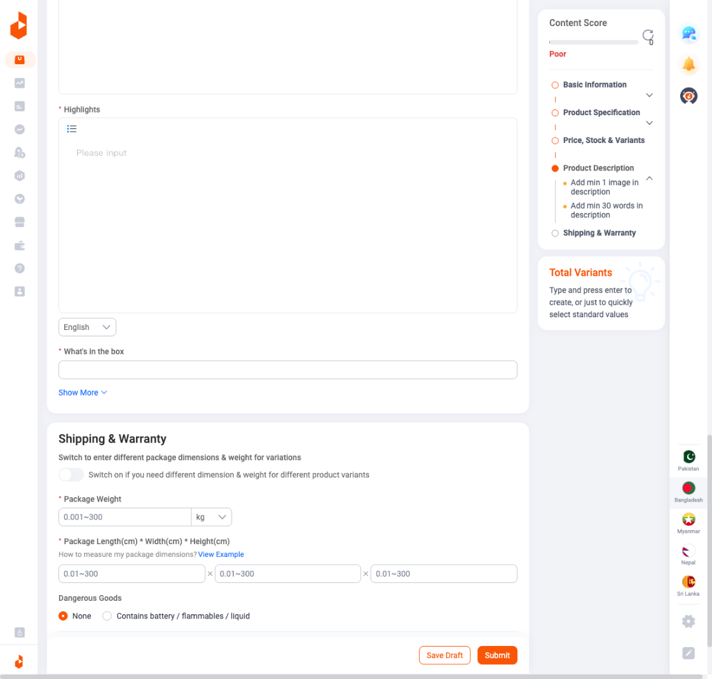

# Add Product - Complete Documentation

> **Module:** Products
> > **Page:** Add Product
> > > **URL:** `https://sellercenter.daraz.com.bd/apps/product/publish`
> > >
> > > ---
> > >
> > > ## Overview
> > >
> > > The Add Product page in Daraz Seller Center allows sellers to create new product listings. This page contains multiple sections that must be completed to publish a product. The page includes a Content Score indicator on the right side that tracks completion progress.
> > >
> > > ---
> > >
> > > ## Page Layout
> > >
> > > The page is organized into the following main sections:
> > >
> > > 1. Basic Information
> > > 2. 2. Product Images
> > >    3. 3. Video
> > >       4. 4. Product Specification
> > >          5. 5. Price, Stock & Variants
> > >             6. 6. Product Description
> > >                7. 7. Highlights
> > >                   8. 8. Shipping & Warranty
> > >                     
> > >                      9. A **Content Score** panel appears on the right side showing completion status for each section.
> > >                     
> > >                      10. ---
> > >                     
> > >                      11. ## 1. Basic Information
> > >
> > > 
> > >
> > > This section contains the essential product identification fields.
> > >
> > > ### 1.1 Product Name
> > >
> > > | Property | Value |
> > > |----------|-------|
> > > | Field Type | Text Input |
> > > | Required | Yes (*) |
> > > | Character Limit | 255 characters |
> > > | Character Counter | Displays current/max (e.g., 44/255) |
> > >
> > > **Description:** Enter the product title that will be displayed to customers. The field includes an AI-powered Bengali translation feature that automatically generates a translated version of the product name.
> > >
> > > **AI Translation Feature:**
> > > - Displays "AI Bengali" badge
> > > - - Shows translated text with character count
> > >   - - Includes "Re-Generate" button to create new translation
> > >    
> > >     - 
> > >    
> > >     - ### 1.2 Category
> > >    
> > >     - | Property | Value |
> > > |----------|-------|
> > > | Field Type | Dropdown Selector |
> > > | Required | Yes (*) |
> > > | Selection | Hierarchical category tree |
> > >
> > > **Description:** Select the appropriate product category from Daraz's predefined category tree. The system displays:
> > > - A dropdown showing the selected category path (e.g., "Mobiles & Tablets > Smart Phones")
> > > - - "Recently used:" section showing previously selected categories as quick-select tags
> > >  
> > >   - **Category Suggestions:**
> > >   - When you enter a product name, the system automatically suggests relevant categories based on keywords detected in the name.
> > >  
> > >   - ---
> > >
> > > ## 2. Product Images
> > >
> > > 
> > >
> > > ### 2.1 Main Product Images
> > >
> > > | Property | Value |
> > > |----------|-------|
> > > | Field Type | Image Upload |
> > > | Required | Yes (*) |
> > > | Minimum | 3 images |
> > > | Maximum | 8 images |
> > >
> > > **Upload Interface:**
> > > - Click the "+" button to upload images
> > > - - Supports drag and drop functionality
> > >  
> > >   - ### 2.2 Buyer Promotion Image
> > >  
> > >   - | Property | Value |
> > >   - |----------|-------|
> > >   - | Field Type | Image Upload |
> > >   - | Required | No |
> > >   - | Label | "White Background Image" |
> > >
> > >   - **Description:** Optional promotional image with white background. A "See Example" link is provided for guidance.
> > >
> > >   - ---
> > >
> > > ## 3. Video Section
> > >
> > > 
> > >
> > > ### Video Upload Options
> > >
> > > | Option | Description |
> > > |--------|-------------|
> > > | Upload Video | Direct video file upload |
> > > | Youtube Link | Embed existing YouTube video URL |
> > > | Media Center | Select from previously uploaded videos |
> > >
> > > **Upload Video Specifications:**
> > > - Minimum size: 480x480 px
> > > - - Maximum video length: 60 seconds
> > >   - - Maximum file size: 100MB
> > >     - - Supported Format: mp4
> > >       - - Processing time: New video might take up to 36 hrs to be approved
> > >        
> > >         - ---
> > >
> > > ## 4. Product Specification
> > >
> > > 
> > >
> > > This section contains technical specifications that vary based on the selected category. For "Mobiles & Tablets > Smart Phones", the following fields are displayed:
> > >
> > > ### Fill Rate Indicator
> > >
> > > A progress bar shows the "Fill Rate" percentage (e.g., 0%). The description states: "Filling in attributes will increase product searchability, driving sales conversion."
> > >
> > > A "Click me" link allows reporting missing attributes.
> > >
> > > ### Specification Fields
> > >
> > > | Field | Type | Required |
> > > |-------|------|----------|
> > > | Brand | Dropdown (Searchable) | Yes (*) |
> > > | Screen Size (inches) | Dropdown | Yes (*) |
> > > | RAM Memory | Dropdown | Yes (*) |
> > > | Camera Back (Megapixels) | Dropdown | Yes (*) |
> > > | Camera Front (Megapixels) | Dropdown | Yes (*) |
> > > | Operating System | Dropdown | Yes (*) |
> > > | Number of SIM | Dropdown | Yes (*) |
> > > | Battery Capacity (mAh) | Dropdown | Yes (*) |
> > >
> > > 
> > >
> > > **Show More:** Additional fields can be revealed by clicking "Show More" link.
> > >
> > > ---
> > >
> > > ## 5. Price, Stock & Variants
> > >
> > > 
> > >
> > > **Section Description:** "You can add variants to a product that has more than one option, such as size or color."
> > >
> > > ### 5.1 Variant Configuration
> > >
> > > #### Variant1 (Required)
> > >
> > > | Property | Value |
> > > |----------|-------|
> > > | Variant Name | Color Family |
> > > | Field Type | Multi-select Dropdown |
> > > | Placeholder | "Please type or select" |
> > >
> > > **Options Available:** The dropdown shows color options that can be selected for the product variants.
> > >
> > > 
> > >
> > > #### Variant2 (Optional)
> > >
> > > | Property | Value |
> > > |----------|-------|
> > > | Variant Name | Storage Capacity |
> > > | Field Type | Multi-select Dropdown |
> > >
> > > **Add Image:** Checkbox option to add images for each variant (Max 8 images per variant).
> > >
> > > **Total Variants:** Displays the combination of all selected variant options.
> > >
> > > ### 5.2 Price & Stock Table
> > >
> > > | Column | Description |
> > > |--------|-------------|
> > > | Price (*) | Enter selling price in local currency (৳) |
> > > | Special Price | Optional discounted price with "Add" link |
> > > | Stock | Inventory quantity |
> > > | SellerSKU | Unique seller SKU identifier (0/200 character limit) |
> > > | Free Items | Optional free items with purchase |
> > > | Availability | Toggle switch (On/Off) to control listing visibility |
> > >
> > > ---
> > >
> > > ## 6. Product Description
> > >
> > > 
> > >
> > > ### Main Description Editor
> > >
> > > | Property | Value |
> > > |----------|-------|
> > > | Field Type | Rich Text Editor |
> > > | Placeholder | "Please input" |
> > >
> > > **Editor Toolbar:**
> > > - Font size selector (11, etc.)
> > > - - Text alignment (left, center, right, justify)
> > >   - - Bullet list
> > >     - - Numbered list
> > >       - - Image insertion
> > >        
> > >         - **Mode Options:**
> > >         - - "Advanced Mode" button - For enhanced editing features
> > >           - - "Preview" button - To preview formatted content
> > >            
> > >             - 
> > >            
> > >             - ---
> > >
> > > ## 7. Highlights
> > >
> > > 
> > >
> > > | Property | Value |
> > > |----------|-------|
> > > | Field Type | Bulleted List Editor |
> > > | Required | Yes (*) |
> > > | Placeholder | "Please input" |
> > >
> > > **Description:** Add key product highlights as bullet points that will appear prominently on the product listing.
> > >
> > > **Features:**
> > > - List icon button for bullet formatting
> > > - - Language selector dropdown (English)
> > >  
> > >   - ### What's in the box
> > >  
> > >   - | Property | Value |
> > >   - |----------|-------|
> > >   - | Field Type | Text Input |
> > >   - | Required | Yes (*) |
> > >
> > >   - **Description:** Describe what items are included with the product.
> > >
> > >   - **Show More:** Link to reveal additional fields.
> > >
> > >   - ---
> > >
> > > ## 8. Shipping & Warranty
> > >
> > > 
> > >
> > > ### 8.1 Package Dimensions Toggle
> > >
> > > **Toggle Description:** "Switch to enter different package dimensions & weight for variations"
> > >
> > > When enabled, allows setting different shipping specifications for each variant.
> > >
> > > ### 8.2 Package Weight
> > >
> > > | Property | Value |
> > > |----------|-------|
> > > | Field Type | Number Input |
> > > | Required | Yes (*) |
> > > | Range | 0.001~300 |
> > > | Unit | kg (dropdown) |
> > >
> > > ### 8.3 Package Dimensions
> > >
> > > | Field | Range | Unit |
> > > |-------|-------|------|
> > > | Length | 0.01~300 | cm |
> > > | Width | 0.01~300 | cm |
> > > | Height | 0.01~300 | cm |
> > >
> > > **Help Link:** "How to measure my package dimensions? View Example"
> > >
> > > ### 8.4 Dangerous Goods
> > >
> > > | Option | Description |
> > > |--------|-------------|
> > > | None | Product contains no hazardous materials |
> > > | Contains battery / flammables / liquid | Product contains restricted items |
> > >
> > > ### 8.5 More Warranty Settings
> > >
> > > Expandable section with "More Warranty Settings" link for additional warranty configuration options.
> > >
> > > ---
> > >
> > > ## Content Score Panel
> > >
> > > Located on the right side of the page, this panel provides real-time feedback on listing completeness.
> > >
> > > ### Score Display
> > >
> > > - Progress indicator showing current score (e.g., "Poor", "Good", "Excellent")
> > > - - Refresh button to recalculate score
> > >  
> > >   - ### Section Checklist
> > >  
> > >   - Each section shows completion status with indicators:
> > >   - - ⭕ Empty circle - Section incomplete
> > >     - - 🟠 Orange circle - Section partially complete
> > >       - - 🟢 Green circle - Section complete
> > >        
> > >         - **Sections tracked:**
> > >         - 1. Basic Information
> > >           2.    - Sub-item: "Add min 3 main images"
> > >                 - 2. Product Specification
> > >                   3. 3. Price, Stock & Variants
> > >                      4. 4. Product Description
> > >                         5.    - Sub-item: "Add min 1 image in description"
> > >                               -    - Sub-item: "Add min 30 words in description"
> > >                                    - 5. Shipping & Warranty
> > >                                     
> > >                                      6. ---
> > >                                     
> > >                                      7. ## Tips Panel
> > >                                     
> > >                                      8. A "Tips" section provides guidance:
> > >
> > > > "Please make sure to upload product images(s), fill product name, and select the correct category to publish a product."
> > > >
> > > > ---
> > > >
> > > > ## Action Buttons
> > > >
> > > > Located at the bottom of the page:
> > > >
> > > > | Button | Style | Action |
> > > > |--------|-------|--------|
> > > > | Save Draft | Orange outline | Saves current progress without publishing |
> > > > | Submit | Orange filled | Submits product for review/publishing |
> > > >
> > > > ---
> > > >
> > > > ## Additional Screenshots Reference
> > > >
> > > > | Screenshot | Description |
> > > > |------------|-------------|
> > > > | screenshot-01-manage-products-dashboard.png | Manage Products main page |
> > > > | screenshot-02-add-product-empty-form.png | Empty Add Product form |
> > > > | screenshot-03-product-name-with-suggestions.png | AI category suggestions |
> > > > | screenshot-04-category-selected-form-expanded.png | Form with category selected |
> > > > | screenshot-05-product-images-section.png | Product Images upload area |
> > > > | screenshot-06-video-youtube-link.png | Video upload options |
> > > > | screenshot-07-brand-search-results.png | Brand dropdown search |
> > > > | screenshot-08-brand-selected-fill-rate.png | Brand selected with fill rate |
> > > > | screenshot-09-variant-color-options.png | Variant color selection |
> > > > | screenshot-10-variant-black-selected.png | Variant with black selected |
> > > > | screenshot-11-product-description-editor.png | Description rich text editor |
> > > > | screenshot-12-product-description-section.png | Product description section |
> > > > | screenshot-13-highlights-section.png | Highlights input area |
> > > > | screenshot-14-shipping-warranty-section.png | Shipping and warranty fields |
> > > >
> > > > ---
> > > >
> > > > ## Navigation
> > > >
> > > > **Breadcrumb:** Homepage > Manage Products > Add Product
> > > >
> > > > **Sidebar Navigation:** The left sidebar provides access to other Seller Center modules.
> > > >
> > > > **Country Selector:** Right side shows country flags for multi-region sellers (Pakistan, Bangladesh, Myanmar, Nepal, Sri Lanka).
> > > >
> > > > ---
> > > >
> > > > *Documentation last updated: January 2026*
