# Media Center Documentation

## Overview

The **Media Center** is a centralized media management feature in Daraz Seller Center that allows sellers to store, organize, and manage all their product images and videos. It serves as a media library that can be accessed when uploading product images during product listing creation.

**URL:** `https://sellercenter.daraz.com.bd/apps/mediacenter`

**Navigation Path:** Products > Media Center

---

## Page Layout

### Header Section

The Media Center header displays:

| Element | Description |
|---------|-------------|
| **Page Title** | "Media Center" - appears at the top of the page |
| **Breadcrumb** | Home > Products > Media Center |
| **Storage Quota** | Shows used storage vs. total available (e.g., "0 B / 10 GB") with a progress indicator |

### Information Alert

A blue information alert appears below the header with format-specific guidance:

- **For Images:** "Please notice the image size should less then 6.0M Only support jpg. png. jpeg."
- **For Videos:** "Please note that the video size should be less then 100MB. Only support wmv, avi, mpg, mpeg, 3gp, mov, mp4, flv, f4v, m4v, m2t, mts, rmvb, vob, mkv"

---

## Main Tabs

The Media Center has two primary tabs:

### 1. Image Tab (Default)

This is the default view when accessing Media Center.

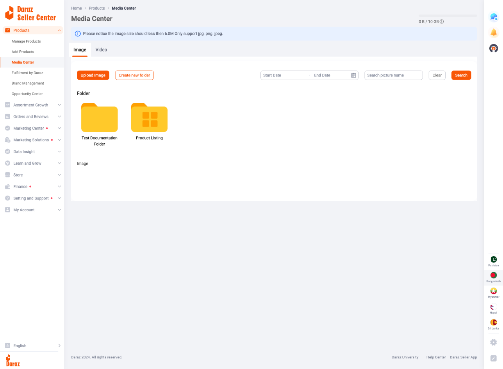

*Media Center main page showing the Image tab (default view) with folders and action buttons*

#### Action Buttons

| Button | Description | Visual Style |
|--------|-------------|--------------|
| **Upload Image** | Opens the image upload modal | Orange filled button |
| **Create new folder** | Opens folder creation dialog | Orange outlined button |

#### Search and Filter Section

| Element | Type | Description |
|---------|------|-------------|
| **Start Date** | Date Picker | Filter images by upload start date |
| **End Date** | Date Picker | Filter images by upload end date |
| **Search picture name** | Text Input | Search for images by filename |
| **Clear** | Button | Reset all search filters |
| **Search** | Button | Execute the search query |

#### Content Area

The content area is divided into two sections:

**Folder Section**
- Displays all created folders as folder icons with names
- Default folder: "Product Listing"
- Custom folders appear alongside the default folder
- Double-click to enter a folder
- Single-click to select a folder

**Image Section**
- Displays all images not inside folders
- Shows image thumbnails with filenames
- Pagination controls at the bottom

### 2. Video Tab

Contains video management features:

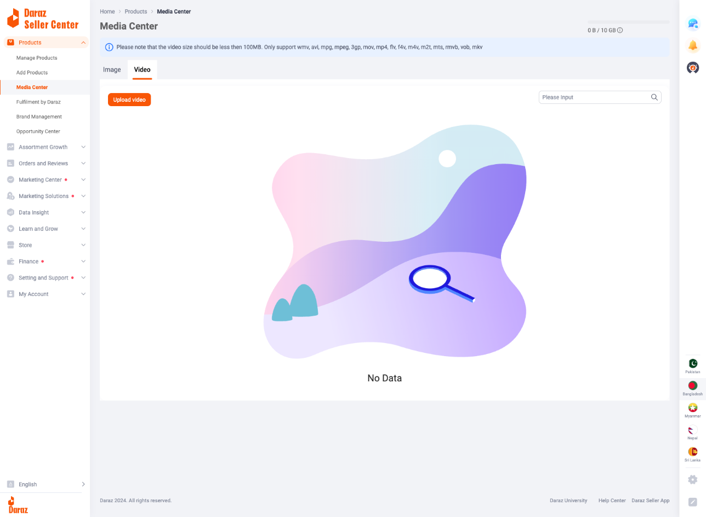

*Video tab view displaying "No Data" state with Upload video button*

#### Action Button

| Button | Description | Visual Style |
|--------|-------------|--------------|
| **Upload video** | Opens the video upload interface | Orange filled button |

#### Search Section

| Element | Type | Description |
|---------|------|-------------|
| **Please Input** | Text Input | Search for videos by name |
| **Search Icon** | Button | Execute the search |

#### Content Area

- Displays uploaded videos
- Shows "No Data" illustration when empty

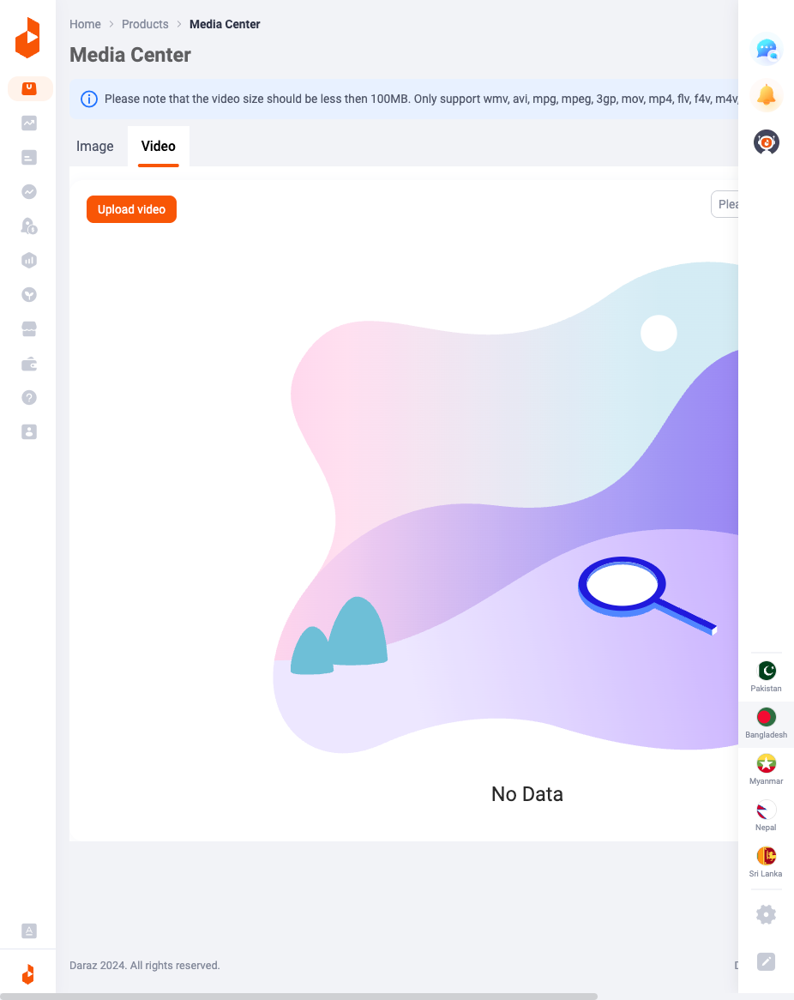

*Video tab displaying empty state with "No Data" illustration and upload button*

---

## Feature Details

### Upload Image Modal

When clicking "Upload Image", a modal dialog opens with two upload methods:

#### Tab 1: Upload Image (Default)

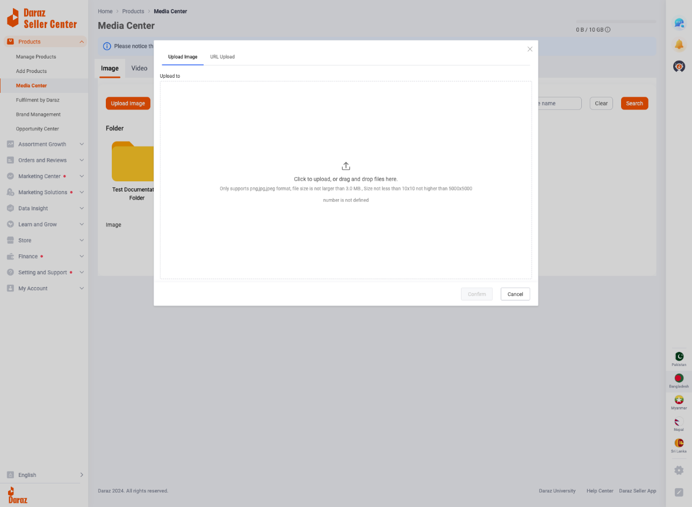

*Upload Image modal with drag-and-drop zone and format requirements*

| Element | Description |
|---------|-------------|
| **Drop Zone** | Large area for drag-and-drop file upload |
| **Click to Upload** | Click anywhere in the drop zone to open file selector |
| **Format Notice** | "Only supports png,jpg,jpeg format, file size is not larger than 3.0 MB., Size not less than 10x10 not higher than 5000x5000" |
| **Confirm Button** | Uploads the selected images |
| **Cancel Button** | Closes the modal without uploading |

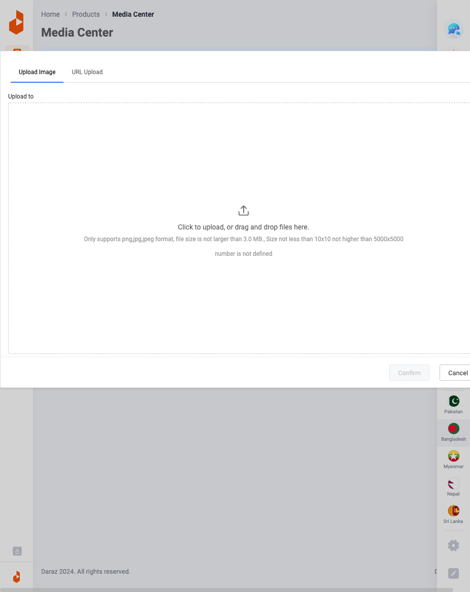

*Detailed view of the upload modal showing the drag-and-drop interface*

**Image Requirements:**
- **Supported Formats:** PNG, JPG, JPEG
- **Maximum File Size:** 3.0 MB (individual file), 6.0 MB (mentioned in header)
- **Minimum Dimensions:** 10 × 10 pixels
- **Maximum Dimensions:** 5000 × 5000 pixels

#### Tab 2: URL Upload

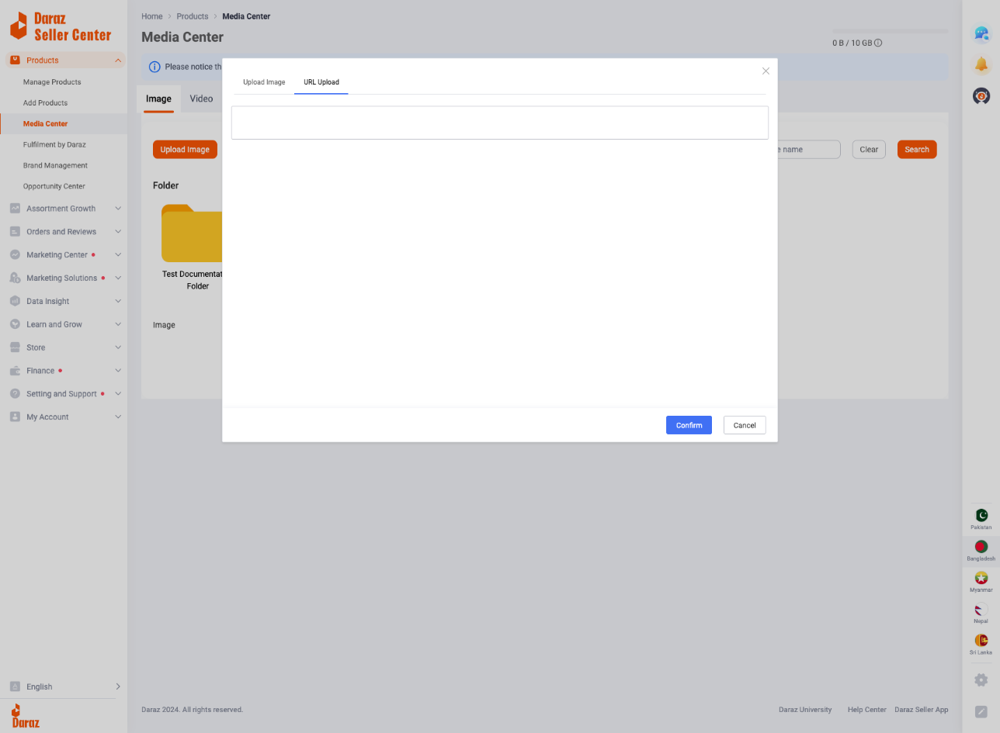

*URL Upload tab allowing image upload from external URLs*

| Element | Description |
|---------|-------------|
| **URL Input Field** | Text input for image URL |
| **Confirm Button** | Downloads image from URL to media center |
| **Cancel Button** | Closes the modal |

This feature allows uploading images directly from a URL without downloading to local machine first.

---

### Create New Folder

Clicking "Create new folder" opens a dialog:

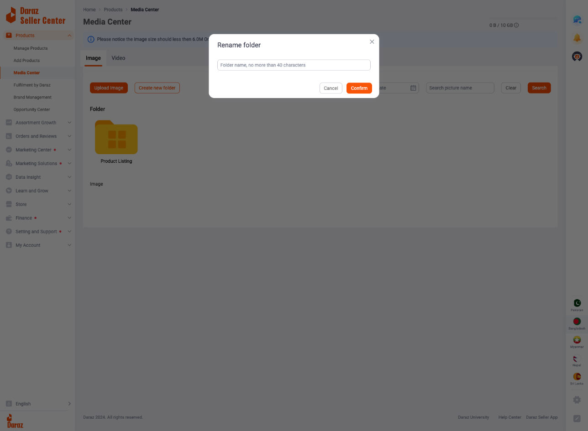

*Create new folder dialog with input field for folder name (max 40 characters)*

| Element | Description |
|---------|-------------|
| **Dialog Title** | "Rename folder" (note: same dialog used for create and rename) |
| **Folder Name Input** | Text input with placeholder "Folder name, no more than 40 characters" |
| **Character Limit** | Maximum 40 characters for folder name |
| **Confirm Button** | Creates/renames the folder |
| **Cancel Button** | Closes without saving |
| **X Button** | Close dialog |

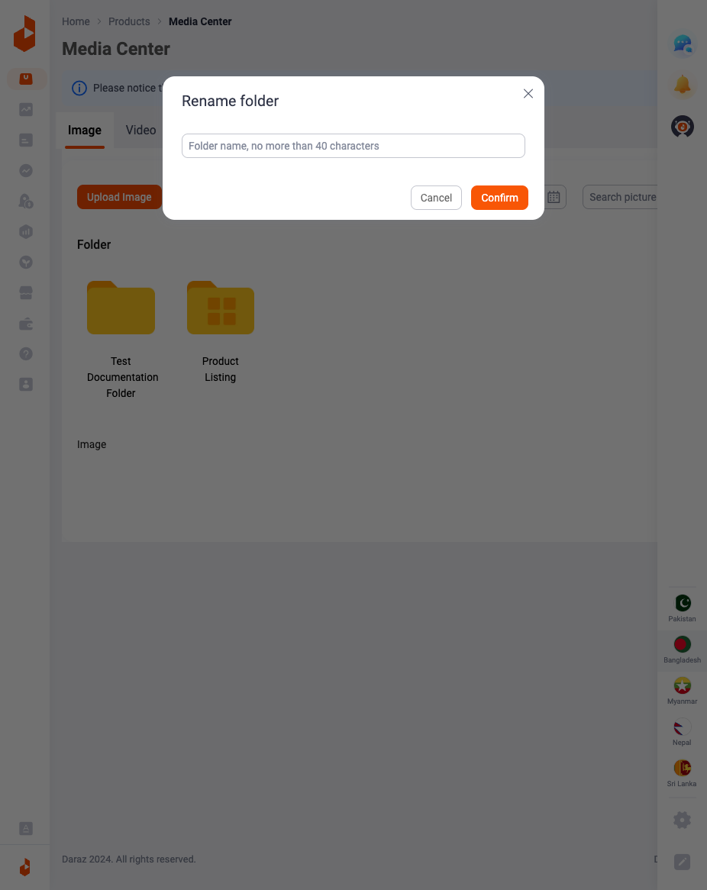

*Create folder dialog with example folder name entered*

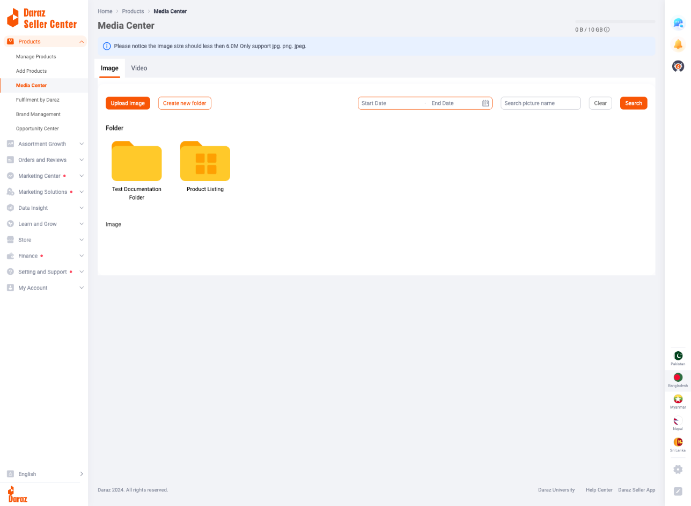

*Media Center showing newly created folder alongside existing folders*

---

### Folder Navigation

**Breadcrumb Navigation:**
- When inside a folder, breadcrumb shows: `Image > [Folder Name]`
- Click "Image" in breadcrumb to return to root
- Click folder name in breadcrumb to stay in current folder

**Folder Interaction:**
- **Single Click:** Selects the folder (shows border)
- **Double Click:** Opens/enters the folder
- **Folder Icon:** Yellow folder icon with grid pattern

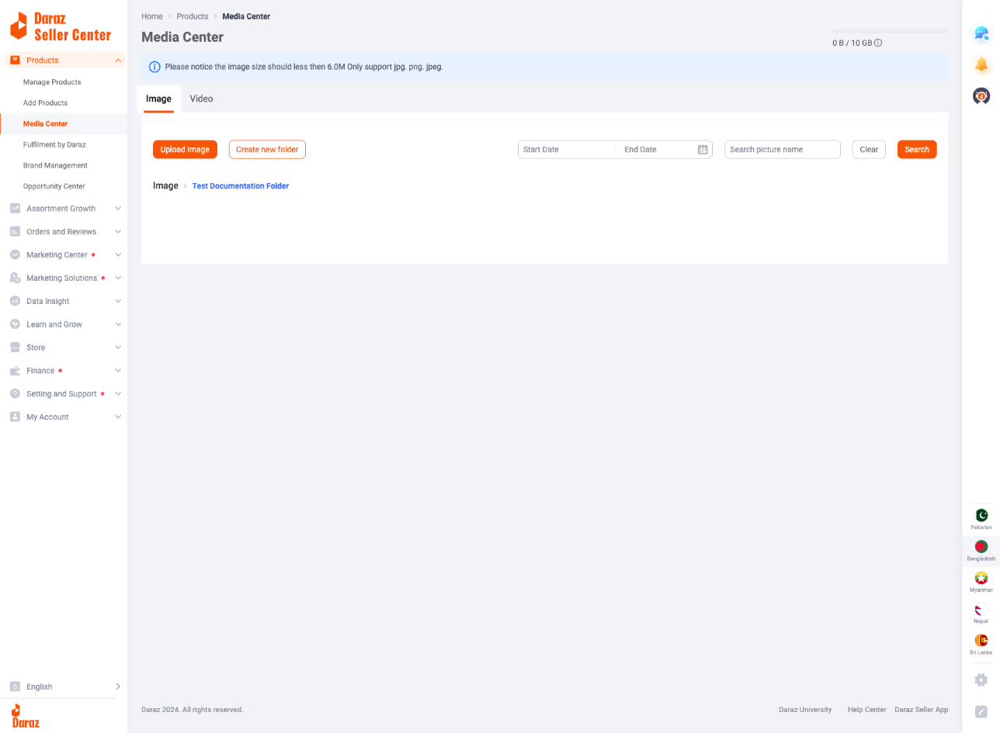

*View inside a folder showing breadcrumb navigation (Image > Folder Name)*

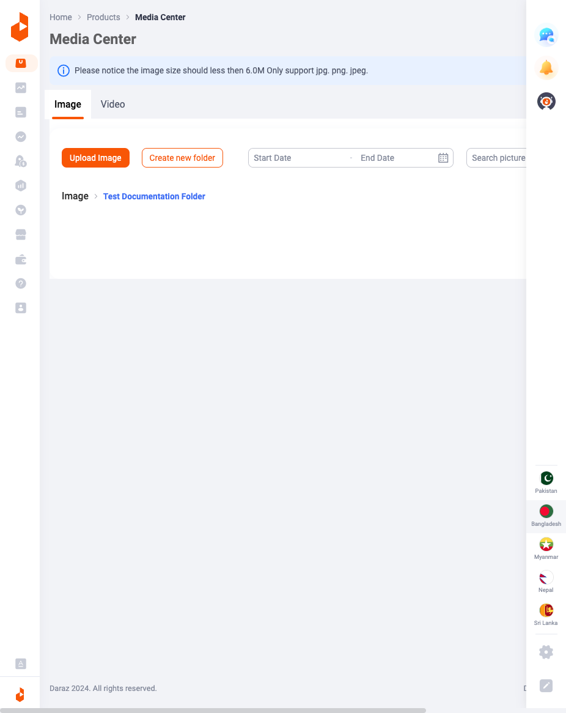

*Inside folder view demonstrating breadcrumb navigation functionality*

---

### Storage Management

**Total Storage:** 10 GB per seller account

**Storage Indicator:**
- Located in the top-right of the page
- Format: `[Used] / [Total]` (e.g., "0 B / 10 GB")
- Circular progress indicator shows visual representation

---

## Video Upload Specifications

| Attribute | Requirement |
|-----------|-------------|
| **Maximum Size** | 100 MB |
| **Supported Formats** | wmv, avi, mpg, mpeg, 3gp, mov, mp4, flv, f4v, m4v, m2t, mts, rmvb, vob, mkv |

---

## Use Cases

### 1. Pre-uploading Product Images

Sellers can upload product images to Media Center before creating product listings. This allows:
- Batch uploading of multiple images
- Organizing images into folders by product category
- Quick access during product creation

### 2. Organizing Media by Category

Create folders for different product categories:
- "Electronics"
- "Fashion"
- "Home & Living"
- "Product Listing" (default)

### 3. Reusing Images

Images stored in Media Center can be reused across multiple product listings without re-uploading.

---

## Best Practices

1. **Use Descriptive Folder Names:** Create folders with clear, descriptive names (up to 40 characters)

2. **Follow Image Guidelines:**
   - Use high-resolution images (min 500×500 recommended for products)
   - Keep file sizes optimized (under 3 MB)
   - Use white backgrounds for main product images

3. **Organize by Product Line:** Create separate folders for different product lines or categories

4. **Clean Up Unused Media:** Regularly remove unused images to manage storage space

5. **Use Consistent Naming:** Name images consistently for easy searching

---

## Technical Details

### API Endpoint Pattern

Based on the platform configuration, API calls use:
- **Domain:** `acs-m.daraz.com.bd`
- **App Key:** `4272`
- **Prefix:** `acs-m`
- **Subdomain:** `daraz`

### Page URL Parameters

The Media Center URL can include tab parameters:
- Image tab: `?tab=image`
- Video tab: `?tab=video`

---

## Regional Availability

Media Center is available across all Daraz regional platforms:

| Country | URL |
|---------|-----|
| Pakistan | `sellercenter.daraz.pk/apps/mediacenter` |
| Bangladesh | `sellercenter.daraz.com.bd/apps/mediacenter` |
| Myanmar | `sellercenter.shop.com.mm/apps/mediacenter` |
| Nepal | `sellercenter.daraz.com.np/apps/mediacenter` |
| Sri Lanka | `sellercenter.daraz.lk/apps/mediacenter` |

---

## Related Features

- **Add Products:** Uses Media Center images for product listings
- **Manage Products:** Edit product images via Media Center integration
- **Store Decoration:** May use Media Center for banner images

---

*Last Updated: January 2026*
