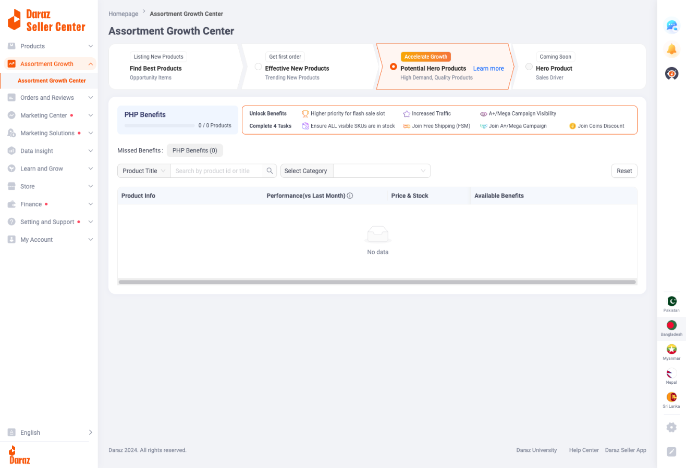

# Assortment Growth Center Documentation

## Overview

**URL:** https://sellercenter.daraz.com.bd/portal/assortment/workbench

**Navigation:** Assortment Growth → Assortment Growth Center

The Assortment Growth Center is a strategic product management hub that helps sellers optimize their product portfolio through a four-stage growth journey. It provides traffic boosting, benefits tracking, and guided tasks to transform new products into high-performing hero products. This feature connects with Opportunity Center to create a complete product discovery-to-growth workflow.

---

## Page Layout

### Header Section

- **Page Title:** "Assortment Growth Center"
- **Breadcrumb Navigation:** Homepage → Assortment Growth Center
- **Main Heading:** "Assortment Growth Center" displayed prominently

### Growth Stage Selector

Four horizontally arranged sections representing different growth strategies. Each section has:
- **Icon Label:** Small tag above each section describing the stage (e.g., "Listing New Products", "Get first order")
- **Section Heading:** Bold title of the growth stage
- **Description:** Subtitle explaining the stage purpose
- **Visual Indicator:** Selected section has orange "Accelerate Growth" badge with highlighted border
- **Radio Button Selection:** Clicking switches between different stage views

**The four stages:**

1. **Find Best Products**
   - Label: "Listing New Products"
   - Description: "Opportunity Items"
   - Function: Links to Opportunity Center for discovering trending products
   - Visual: Standard appearance, no special highlighting

2. **Effective New Products**
   - Label: "Get first order"
   - Description: "Trending New Products"
   - Function: Get Up to 3x Traffic Support for new listings
   - Visual: Standard appearance when not selected

3. **Potential Hero Products (PHP)**
   - Label: "Accelerate Growth" (orange badge)
   - Description: "High Demand, Quality Products"
   - Function: High demand, quality products with priority benefits
   - Visual: Orange highlighted border when selected, "Learn more" link to Daraz University course (ID: 43204)
   - Default: This section is selected by default

4. **Hero Product**
   - Label: "Coming Soon" (grayed out)
   - Description: "Sales Driver"
   - Status: Not yet available
   - Visual: Grayed out appearance, non-clickable

---

## Section 1: Find Best Products

**Purpose:** Redirects sellers to Opportunity Center for product discovery and recommendations.

**Functionality:**
- Clicking this section navigates to: https://sellercenter.daraz.com.bd/apps/product/gap/index
- Allows sellers to discover trending products
- Provides access to marketplace insights and high-demand products
- Serves as the starting point for the growth journey

**Integration:**
- Direct link to Opportunity Center
- Products discovered here can be uploaded to qualify for Effective New Products benefits
- Forms the foundation of the growth strategy

---

## Section 2: Effective New Products

**URL Parameter:** `?tab=EN`

**Purpose:** Help new products gain traction with traffic boosting to get the first orders and build momentum.

*Effective New Products section showing the 3x Traffic Support banner, Complete 3 Tasks section, and performance metrics dashboard.*

### Traffic Support Banner

Large promotional banner at the top displaying:
- **Main Offer:** "Get Up to 3x Traffic Support" in large text
- **Validity:** "for new products" and "Valid for L60D (Last 60 Days)"
- **Visual:** Purple/blue gradient background with graphics

### Complete 3 Tasks Section

Displays three required actions sellers must complete to qualify for traffic boost:

1. **Join Early Bird Price Discount (Mandatory)**
   - Icon: Price tag symbol
   - Status: Required for program enrollment
   - This task is essential for eligibility

2. **Join Free Shipping (FSM)**
   - Icon: Shipping truck symbol
   - Status: Optional but recommended
   - Increases conversion by offering free shipping to customers

3. **Join A+/Mega Campaign**
   - Icon: Megaphone/campaign symbol
   - Status: Optional but recommended
   - Provides additional visibility through promotional campaigns

### Performance Metrics Dashboard

Four key performance indicators displayed horizontally:

1. **Products currently boosted:** Count of products actively receiving traffic boost
2. **Boosted & Selling Products (vs L14 days):** Comparison metric showing performance
3. **L60D Effective New Product Orders in L14D:** Recent order count for boosted products
4. **L60D Effective New Product GMV in L14D (৳):** Gross Merchandise Value in Bangladeshi Taka

### Status Tabs

Four tabs for filtering products by status:
- **Current Status:** Products currently receiving benefits
- **Tasks or Orders Pending:** Products waiting for task completion or first orders
- **Promoted:** Products successfully promoted with boost active
- **Dropped out:** Products that lost eligibility or benefits ended

### Search and Filter Options

- **Product Title:** Search box for finding products by ID or title
- **Product Stage:** Dropdown filter for product stage selection
- **New Item Source:** Filter by where the product originated
- **Reset Button:** Clears all applied filters

### Product Table

When products exist, displays columns:
- **Product Information:** Image, title, and product details
- **Product Performance:** Metrics with tooltip showing additional information
- **Boosting Tasks & Status:** Current task completion status with tooltip

### Empty State

When no eligible products exist:
- **Visual:** Orange circular icon with white "X" symbol centered on decorative background
- **Message:** "No data" displayed below the icon
- **Meaning:** Seller needs to upload products from Opportunity Center to see data here

---

## Section 3: Potential Hero Products (PHP)

**URL Parameter:** `?tab=PHP`

**Purpose:** Develop high-performing products with enhanced benefits to drive significant sales growth.

*PHP section showing the Unlock Benefits progress bar, 4 required tasks, and the product table with filters.*

### PHP Benefits Progress Section

**Layout:** Horizontal bar with benefits display and progress tracker

**Left Side - Benefits Overview:**
- **"Unlock Benefits" label** (orange icon)
- **Progress Bar:** Shows "0 / 0 Products" (current qualified vs total eligible)
- **Four Benefits Listed:**
  1. Higher priority for flash sale slot (rocket icon)
  2. Increased Traffic (graph icon)
  3. A+/Mega Campaign Visibility (eye icon)
  4. Complete 4 Tasks label

**Right Side - Required Tasks:**
- **"Complete 4 Tasks" heading** with explanatory text
- **Four Mandatory Tasks** (all must be completed simultaneously):
  1. Ensure ALL visible SKUs are in stock (checkmark icon)
  2. Join Free Shipping (FSM) (truck icon)
  3. Join A+/Mega Campaign (megaphone icon)
  4. Join Coins Discount (coin icon)

**Visual Design:**
- Orange border around the entire PHP Benefits section
- Icons for each benefit and task
- Progress bar shows fraction format

### Missed Benefits Filter

- **Label:** "Missed Benefits:"
- **Dropdown:** "PHP Benefits (0)"
- **Purpose:** Shows products that could have received benefits but didn't meet criteria
- **Function:** Helps sellers identify improvement opportunities

### Search and Filter Options

- **Product Title:** Dropdown selector with search capability
  - Placeholder: "Search by product id or title"
  - Includes search icon button
- **Select Category:** Dropdown for category filtering
  - Default: "All Category"
- **Reset Button:** Clears all filters

### Product Table

**Column Headers:**
1. **Product Info:** Product image, title, and details
2. **Performance (vs Last Month):** Month-over-month comparison metrics (has tooltip icon)
3. **Price & Stock:** Current pricing and inventory status
4. **Available Benefits:** Which PHP benefits the product qualifies for (has tooltip icon)

### Empty State

When no eligible products:
- **Visual:** Orange delivery truck icon with circular background
- **Message:** "No data"
- **Context:** Either no products uploaded or no products meet PHP criteria

**What "No Data" Means:**
- No products have completed all 4 required tasks simultaneously
- Products may exist but don't meet the PHP qualification standards
- Seller needs to work on existing products or list new high-demand items

---

## Section 4: Hero Product

**Status:** Coming Soon (Not Yet Available)

**Visual Appearance:**
- Grayed out section with "Coming Soon" label
- Title: "Hero Product"
- Description: "Sales Driver"
- Non-interactive (cannot be clicked)

**Expected Purpose:**

Based on the growth progression, this will likely be:
- The final stage for top-performing products
- Products that have graduated from PHP status
- Elite product tier with maximum benefits
- Sales-driving hero items that anchor the store

**Current Status:** Feature planned for future release

---

## Key Features Explained

### Traffic Support (3x Boost)

**What It Is:**
- New products receive up to 3 times more traffic than standard listings
- Increased visibility in search results and category pages
- Higher placement priority

**Duration:**
- Valid for L60D (Last 60 Days) period
- Countdown starts from product upload date
- Helps products gain initial traction and first orders

**Eligibility:**
- Product must be uploaded from Opportunity Center
- Must complete Early Bird Price Discount (mandatory)
- Additional tasks (FSM, A+/Mega) provide cumulative benefits

### PHP Benefits System

**Four Main Benefits:**

1. **Higher Priority for Flash Sale Slot**
   - Greater chance of being selected for flash sales
   - Priority placement in promotional events
   - Access to high-traffic sale periods

2. **Increased Traffic**
   - Sustained organic traffic boost beyond initial 60 days
   - Better search ranking
   - Category page prominence

3. **A+/Mega Campaign Visibility**
   - Featured placement in major campaigns
   - Homepage visibility opportunities
   - Promotional banner inclusion

4. **Coins Discount Integration**
   - Product eligible for Daraz Coins redemption
   - Attracts deal-seeking customers
   - Increases conversion rates

**Qualification Requirements:**
- **ALL 4 tasks must be active simultaneously**
- No partial qualification - it's all or nothing
- Benefits unlock only when all criteria are met
- Must be maintained continuously to keep benefits

### Performance Tracking Metrics

**Time Periods:**
- **L14D:** Last 14 Days (short-term performance)
- **L60D:** Last 60 Days (medium-term trends)

**Key Metrics:**
- **Order Count:** Number of orders received
- **GMV (Gross Merchandise Value):** Total sales value in BDT
- **Comparison Metrics:** "vs Last Month" or "vs L14 days" for trend analysis
- **Product Count:** Products boosted, qualified, or selling
- **Traffic Uplift:** Actual traffic increase received

**Dashboard Benefits:**
- Real-time performance visibility
- Quick identification of successful products
- Data-driven decision making
- Trend analysis for optimization

---

## Growth Journey Workflow

*Overview of the four growth stages from Find Best Products through to Hero Product.*

### Stage 1: Find Best Products

**Actions:**
1. Navigate to Assortment Growth Center
2. Click "Find Best Products" section
3. System redirects to Opportunity Center
4. Browse trending products by category
5. Use filters to find relevant opportunities
6. Click "Upload" on selected products

**Outcome:** Products added to your catalog from Opportunity Center

### Stage 2: Effective New Products

**Actions:**
1. Products uploaded from Opportunity Center appear here automatically
2. Complete mandatory task: Join Early Bird Price Discount
3. Optionally complete: Join Free Shipping (FSM)
4. Optionally complete: Join A+/Mega Campaign
5. Monitor performance metrics dashboard
6. Track orders and GMV in L14D period

**Outcome:** Products receive up to 3x traffic boost for 60 days

### Stage 3: Potential Hero Products (PHP)

**Actions:**
1. Products performing well may qualify for PHP status
2. Complete ALL 4 tasks simultaneously:
   - Ensure all SKUs in stock
   - Join Free Shipping (FSM)
   - Join A+/Mega Campaign
   - Join Coins Discount
3. Monitor "Unlock Benefits" progress bar
4. Use "Missed Benefits" filter to identify improvement areas
5. Track performance vs last month

**Outcome:** Products receive premium benefits including flash sale priority, increased traffic, and campaign visibility

### Stage 4: Hero Product (Coming Soon)

**Expected Actions:**
1. Top PHP products graduate to Hero status
2. Receive maximum platform support
3. Become store anchor products
4. Drive significant sales volume

**Outcome:** Elite product status with maximum benefits

---

## Best Practices

### Maximizing Traffic Boost

1. **Upload from Opportunity Center:** Always use the "Find Best Products" workflow
2. **Complete Tasks Quickly:** Join Early Bird Price Discount immediately after upload
3. **Stack Benefits:** Complete all 3 tasks for maximum 3x boost
4. **Monitor Daily:** Track performance metrics regularly during the 60-day window
5. **Optimize Listings:** Use high-quality images and complete product information

### Achieving PHP Status

1. **Maintain Stock:** Keep all visible SKUs in stock at all times
2. **Join All Programs:** Enroll in FSM, Campaign, and Coins simultaneously
3. **Stay Enrolled:** Don't let any program membership lapse
4. **Focus on Quality:** High-demand products have better PHP qualification chances
5. **Regular Audits:** Check "Missed Benefits" filter weekly

### Performance Optimization

1. **Track Trends:** Compare L14D metrics with previous periods
2. **Identify Winners:** Focus resources on products with positive trajectory
3. **Address Drops:** Investigate products that lost boost status
4. **Set Goals:** Target specific GMV and order count improvements
5. **Learn from Data:** Use performance insights to select future products

---

## Troubleshooting

### Issue: Products Not Appearing in Effective New Products

**Possible Causes:**
- Products not uploaded from Opportunity Center
- Products uploaded but not matched correctly
- 60-day window has expired

**Solutions:**
- Upload products using the Opportunity Center workflow
- Check if products appear in Opportunity Center "Uploaded" page
- Upload new products to restart the 60-day timer

### Issue: Not Receiving 3x Traffic Boost

**Possible Causes:**
- Early Bird Price Discount not joined (mandatory)
- Tasks not completed
- Product not eligible

**Solutions:**
- Ensure Early Bird Price Discount is active
- Complete remaining optional tasks for full benefit
- Check product eligibility in Opportunity Center

### Issue: PHP Benefits Not Unlocking

**Possible Causes:**
- Not all 4 tasks completed simultaneously
- One or more SKUs out of stock
- Program membership lapsed

**Solutions:**
- Verify ALL 4 tasks are active at the same time
- Stock: Check all visible SKUs have inventory
- FSM: Confirm Free Shipping is enabled
- Campaign: Confirm participation in current A+/Mega campaign
- Coins: Check Coins discount is enabled and active

### Issue: Products Showing "Dropped Out" Status

**Possible Causes:**
- 60-day window expired
- Tasks were discontinued
- Product became ineligible

**Solutions:**
- Check timeline - 60 days may have passed
- Re-enable any disabled tasks
- Focus on other products still in active window
- Upload new products to restart cycle

### Issue: "0 / 0 Products" in PHP Progress Bar

**Possible Causes:**
- No products qualify for PHP status
- No products have completed all 4 tasks
- Products exist but don't meet quality thresholds

**Solutions:**
- Complete all 4 tasks for at least one product to see "1 / X Products"
- Use "Missed Benefits" filter to identify which products almost qualify
- Focus on highest-performing products first
- Ensure product quality meets PHP standards

---

## Important Notes

1. **Sequential Growth:** The stages represent a growth journey - products progress from discovery to hero status over time.

2. **Task Dependency:** Different stages have different task requirements:
   - Effective New: 1 mandatory + 2 optional tasks
   - PHP: ALL 4 tasks mandatory simultaneously

3. **Time Windows:**
   - L60D (60 days) for Effective New Product benefits
   - L14D metrics for performance comparisons
   - Benefits are time-limited and must be earned

4. **Integration:** This feature works with:
   - Opportunity Center (product discovery)
   - Free Shipping Manager (FSM)
   - Campaign Center (A+/Mega campaigns)
   - Coins discount program

5. **Coming Features:** Hero Product stage is announced but not yet available - plan your growth strategy with this future stage in mind.

6. **Learn More:** Access Daraz University course (ID: 43204) for detailed PHP training through the "Learn more" link in the PHP section.

---

## Related Documentation

- [Opportunity Center Documentation](../05-opportunity-center/README.md) - For product discovery
- [Add Product Documentation](../01-add-product/README.md) - For creating product listings
- [Manage Products Documentation](../03-manage-products/README.md) - For product management

---

*Last Updated: January 2026*
