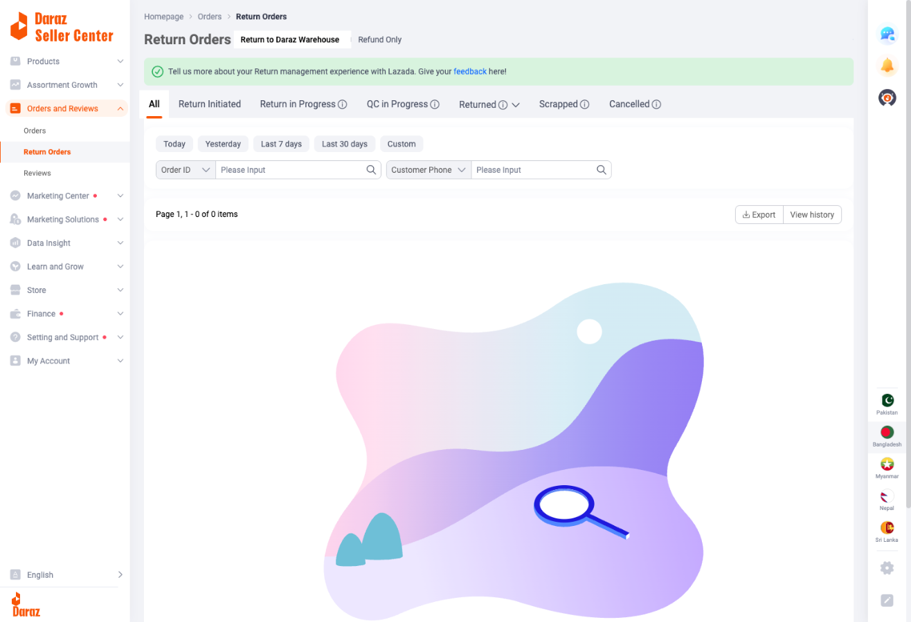

# Return Orders Documentation

## Overview

**URL:** https://sellercenter.daraz.com.bd/apps/order/reverse

**Navigation:** Orders and Reviews → Return Orders

The Return Orders management system is a dedicated interface for handling all product returns and refund requests from customers. It provides two distinct workflows: returns with physical product returns to warehouse (with QC inspection), and refund-only requests where customers keep products. Sellers can track return status, approve/reject requests, monitor quality checks, and manage disputes through a comprehensive status-based workflow system.

## Page Layout

### Header Section

- **Page Title:** "Return Orders"
- **Breadcrumb Navigation:** Homepage → Orders → Return Orders
- **Main Heading:** "Return Orders" displayed prominently

### Feedback Banner

**Green Information Banner** (Dismissible):
- Icon: Green checkmark in circle
- Message: "Tell us more about your Return management experience with Lazada. Give your feedback here!"
- Link: "feedback" (blue hyperlink)
- Purpose: Collect seller feedback on return management experience
- Can be closed/dismissed

### Main Return Type Tabs

Two primary tabs that determine the return workflow:

1. **Return to Daraz Warehouse** (Default)
   - Customer ships product back to Daraz facility
   - Quality Check (QC) inspection performed
   - Refund processed after QC approval
   - Item may be restocked if passes inspection
   - Full return workflow with physical item handling

2. **Refund Only**
   - Customer keeps the product
   - Refund issued without item return
   - Faster resolution process
   - Used for: Partial refunds, damaged items not worth return shipping, goodwill gestures
   - Seller bears cost without product recovery

---

## Return to Daraz Warehouse Workflow

*Shows the default "Return to Daraz Warehouse" tab with status tabs (All, Return Initiated, Return in Progress, QC in Progress, Returned, Scrapped, Cancelled), date filter, search options, and empty state illustration.*

### Status Tabs

Seven tabs representing different stages of the return-to-warehouse process:

1. **All** - View all returns regardless of status
2. **Return Initiated** - New return requests awaiting seller action
3. **Return in Progress** - Returns approved, item being shipped back
4. **QC in Progress** - Item received, undergoing quality inspection
5. **Returned** (with info icon) - QC approved, refund processed, return complete
6. **Scrapped** (with info icon) - Item damaged/unsellable, disposed but refund issued
7. **Cancelled** (with info icon) - Return request cancelled by customer or seller

**Info Icons:** Hoverable tooltips provide detailed explanations of each status

*Detailed view of the seven status tabs for Return to Daraz Warehouse workflow with info icons on Returned, Scrapped, and Cancelled tabs.*

### Date Filters

Five preset date range options:

- **Today** - Returns from current day
- **Yesterday** - Previous day's returns
- **Last 7 days** - Week view
- **Last 30 days** - Month view
- **Custom** - Date range picker (Start Date to End Date)

### Search Filters

Two search options for locating specific returns:

1. **Order ID**
   - Dropdown selector with text input
   - Placeholder: "Please Input"
   - Search icon button
   - Find returns by original order number

2. **Customer Phone**
   - Dropdown selector with text input
   - Placeholder: "Please Input"
   - Search icon button
   - Locate returns by customer contact

### Action Buttons

Two primary actions available:

1. **Export** - Download return data
   - CSV/Excel format
   - Filtered results export
   - Includes all return details

2. **View history** - Historical return records
   - Past return activities
   - Resolution history
   - Performance tracking

### Return Table

When returns exist, table displays:

- **Order Information** - Original order details
- **Product Details** - Item being returned
- **Return Reason** - Customer's stated reason
- **Return Status** - Current workflow stage
- **Requested Date** - When return initiated
- **Actions** - Available seller actions (Approve, Reject, View Details)

### Empty State

When no returns match filters:
- **Visual:** Decorative illustration with magnifying glass
- **Pastel gradient background:** Pink, light blue, purple blend
- **Icon:** Blue magnifying glass with white circle
- **Message:** "No return order under this status or filter"
- **Pagination:** "Page 1, 1 - 0 of 0 items"

### Pagination

- Previous/Next buttons
- Page number display
- Total items count

---

## Refund Only Workflow

*Shows the "Refund Only" tab with its status tabs (All, Pending Seller Decision, Pending Daraz Decision, In Dispute, Refund Issued, Refund Only Request Closed, Rejected), date filter, search options, and empty state illustration.*

### Status Tabs

Seven tabs for refund-only request lifecycle:

1. **All** - All refund requests
2. **Pending Seller Decision** - Awaiting seller approval/rejection
3. **Pending Daraz Decision** - Escalated to platform review
4. **In Dispute** - Disagreement between seller and customer
5. **Refund Issued** - Refund payment processed
6. **Refund Only Request Closed** - Request completed/resolved
7. **Rejected** - Request denied by seller or platform

*Detailed view of the seven status tabs for Refund Only workflow.*

### Date Filters

Same as Return to Warehouse:
- Today
- Yesterday
- Last 7 days
- Last 30 days
- Custom (date range picker)

### Search Filters

Identical search options:

1. **Order ID** - Find by order number
2. **Customer Phone** - Locate by customer contact

### Refund Table

Displays when refund requests exist:

- **Order Information** - Original purchase details
- **Product Details** - Item for which refund requested
- **Refund Amount** - Requested refund value (full or partial)
- **Reason** - Customer explanation
- **Status** - Current stage in workflow
- **Requested Date** - Submission timestamp
- **Actions** - Approve Full/Partial, Reject, Counter-offer

### Key Differences from Return to Warehouse

**No Physical QC:**
- No "QC in Progress" stage
- No product inspection
- No restocking possibility

**Decision-Based Workflow:**
- Focus on seller/platform decisions
- Dispute resolution mechanism
- Direct approval/rejection flow

**Faster Resolution:**
- Fewer workflow stages
- No shipping delays
- Immediate refund upon approval

---

## Detailed Status Explanations

### Return to Daraz Warehouse Statuses

#### 1. Return Initiated

**What It Means:**
- Customer submitted return request
- Awaiting seller review and approval
- No action taken yet

**Seller Actions Available:**
- **Approve:** Customer receives return shipping label, moves to "Return in Progress"
- **Reject:** Provide reason, customer notified, may escalate to dispute
- **Request Info:** Ask customer for photos, additional details

**Decision Criteria:**
- Within return policy window (typically 7-14 days)
- Valid return reason (defective, wrong item, damaged, not as described)
- Product eligibility (non-returnable items: intimate apparel, personalized, perishables)

**Timeline:**
- Seller should respond within 24-48 hours
- Delays may result in automatic approval

#### 2. Return in Progress

**What It Means:**
- Return approved by seller
- Return shipping label generated
- Customer packing and shipping item back
- Tracking number assigned

**Current State:**
- Item in transit to Daraz warehouse
- Estimated arrival date displayed
- Tracking updates visible

**Typical Duration:**
- 3-7 days depending on location
- Longer for remote areas

**Seller Actions:**
- Monitor tracking status
- Communicate with customer if shipping delays
- Prepare for QC result

#### 3. QC in Progress

**What It Means:**
- Item arrived at Daraz warehouse
- Quality Control team inspecting product
- Verifying customer's return reason
- Assessing item condition

**Inspection Points:**
- **Condition:** Item used/damaged/new
- **Completeness:** All accessories included
- **Authenticity:** Correct product received
- **Damage Type:** Pre-existing vs shipping damage
- **Reason Validity:** Matches customer claim

**Seller Involvement:**
- Limited control during QC
- QC results binding
- Can dispute if evidence of fraud

**Typical QC Duration:**
- 1-3 business days
- Complex cases may take longer

#### 4. Returned (Completed)

**What It Means:**
- QC inspection passed
- Item condition acceptable
- Refund automatically processed
- Return completed successfully

**What Happens:**
- **Refund Issued:** Full refund to customer's original payment method
- **Item Disposition:**
  - If resellable: Returned to seller's inventory
  - If minor damage: May sell as "Open Box" with discount
  - If not resellable: Moves to Scrapped

**Refund Timeline:**
- Immediate system refund initiation
- 3-7 days for payment processing
- Depends on customer's bank/payment method

**Impact on Seller:**
- Return recorded in metrics
- High return rates affect seller score
- Inventory adjustment

#### 5. Scrapped

**What It Means:**
- Item received but damaged/unusable
- Cannot be restocked
- Product will be disposed/recycled
- **Refund still processed to customer**

**Common Reasons:**
- Item damaged during return shipping
- Product defective beyond repair
- Hygiene issues (certain categories)
- Missing critical components

**Financial Impact:**
- Seller loses product AND issues refund
- Total loss unless proven customer fault
- Shipping damage may be courier's responsibility

**Dispute Options:**
- If damage occurred post-delivery, seller can dispute
- Evidence required: delivery photos, timestamps
- Platform reviews and decides

#### 6. Cancelled

**What It Means:**
- Return request withdrawn/cancelled
- Customer keeps product
- No refund processed

**Cancellation Triggers:**

**Customer-Initiated:**
- Changed mind about returning
- Resolved issue with seller directly
- Found alternative solution

**Seller-Initiated:**
- Offered alternative (replacement, partial refund)
- Negotiated direct resolution
- Customer accepted compromise

**Platform-Initiated:**
- Return request invalid (outside policy window)
- Non-returnable item category
- Fraudulent return detected

**Final Outcome:**
- Order status reverts to "Delivered"
- No financial transaction
- Case closed

---

### Refund Only Statuses

#### 1. Pending Seller Decision

**What It Means:**
- Customer requested refund without return
- Awaiting seller approval
- Product remains with customer

**Seller Actions:**
- **Approve Full Refund:** Issue complete refund, close case
- **Approve Partial Refund:** Offer percentage of order value
- **Reject:** Deny request with reason
- **Counter-offer:** Propose alternative resolution

**Decision Factors:**
- Severity of issue
- Product value
- Customer history
- Proof provided (photos, videos)

**Timeline:**
- Respond within 24-48 hours
- Delays may auto-approve

#### 2. Pending Daraz Decision

**What It Means:**
- Seller rejected or customer escalated
- Platform team reviewing case
- Both parties presented evidence

**What Platform Reviews:**
- Order history and details
- Customer complaint validity
- Seller's response and reason
- Photos/videos provided
- Communication history
- Seller performance metrics
- Customer complaint history

**Outcome Possibilities:**
- Approve refund (full or partial)
- Deny refund, side with seller
- Request additional information
- Mandate specific resolution

**Timeline:**
- 3-5 business days typical
- Complex cases up to 7-10 days

**Seller Actions:**
- Provide any additional evidence
- Respond to platform inquiries promptly
- Accept platform decision (usually final)

#### 3. In Dispute

**What It Means:**
- Active disagreement between seller and customer
- Both parties contesting resolution
- May involve platform mediation

**Dispute Triggers:**
- Seller rejection appealed by customer
- Customer disputes partial refund offer
- Disagreement on fault/responsibility
- Conflicting evidence

**Resolution Process:**
- Platform acts as mediator
- Reviews all evidence from both sides
- May request additional proof
- Makes binding decision

**Seller Best Practices:**
- Remain professional in communication
- Provide clear evidence (photos, descriptions)
- Reference platform policies
- Demonstrate good faith efforts

**Typical Duration:**
- 5-10 business days
- May extend for complex cases

#### 4. Refund Issued

**What It Means:**
- Refund approved and processed
- Payment sent to customer
- Case resolved in customer's favor

**Refund Details:**
- Amount: Full or partial based on decision
- Method: Original payment method
- Timeline: 3-7 days for customer receipt
- Customer keeps product

**Seller Impact:**
- Financial loss (refund amount)
- Product remains with customer
- Recorded in refund metrics
- May affect seller performance score

**Post-Refund:**
- Case closed
- No further action required
- Review for pattern analysis

#### 5. Refund Only Request Closed

**What It Means:**
- Case fully completed and closed
- Final status reached
- No pending actions

**Closure Reasons:**
- Refund issued and confirmed received
- Request withdrawn by customer
- Alternative resolution accepted
- Platform closed case

**Final State:**
- Archived in history
- Metrics recorded
- Available in reports
- Case reference retained

#### 6. Rejected

**What It Means:**
- Refund request denied
- Customer keeps product without refund
- Decision final (unless customer escalates)

**Valid Rejection Reasons:**
- Outside return policy window
- No defect/damage evidence
- Customer fault/misuse
- Product as described
- Returnable item, customer must use standard return

**Communication:**
- Clear explanation required
- Reference specific policy
- Offer alternatives if possible
- Professional tone essential

**Customer Options Post-Rejection:**
- Accept decision
- Escalate to Daraz platform
- Initiate standard return-to-warehouse
- Dispute resolution process

---

## Key Workflows

### Workflow 1: Approving Return to Warehouse Request

**Step 1: New Return Alert**
1. Return request appears in "Return Initiated" tab
2. System notification received
3. Review timer starts (24-48 hours)

**Step 2: Review Return Request**
1. Navigate to Return Orders page
2. Click "Return Initiated" tab
3. Locate specific return request
4. Click to view full details:
   - Original order information
   - Product details and price
   - Customer's return reason
   - Photos/evidence uploaded
   - Days since delivery
   - Return policy eligibility

**Step 3: Evaluate Validity**

**Check Policy Compliance:**
- Within return window? (typically 7-14 days from delivery)
- Returnable product category?
- Valid reason? (defective, wrong item, not as described, damaged)

**Assess Evidence:**
- Photos show claimed issue?
- Description matches product condition?
- Reasonable explanation?

**Consider Factors:**
- Customer history (first return vs serial returner)
- Product value
- Reason plausibility

**Step 4: Make Decision**

**If Approving:**
1. Click "Approve" button
2. Confirmation message appears
3. System generates return shipping label
4. Customer receives email with label and instructions
5. Status automatically changes to "Return in Progress"

**If Rejecting:**
1. Click "Reject" button
2. Select rejection reason from dropdown
3. Add detailed explanation (required)
4. Submit rejection
5. Customer notified
6. Customer may escalate to platform

**If Need More Info:**
1. Click "Request Information" button
2. Specify what's needed (photos, description, proof)
3. Customer receives request
4. Return remains in "Return Initiated"
5. Awaits customer response

**Step 5: Monitor Return Progress**
1. Status changes to "Return in Progress"
2. Track shipment via tracking number
3. Monitor estimated warehouse arrival
4. Prepare for QC result

**Step 6: QC Result**
1. Item arrives at warehouse
2. QC team inspects (1-3 days)
3. Status updates automatically:
   - **Returned:** Approved, refund issued
   - **Scrapped:** Damaged but refunded
   - **Cancelled:** Issue found (rare)

**Step 7: Handle Outcome**

**If Returned (Approved):**
- Refund automatically processed
- Item returned to inventory if resellable
- Monitor refund completion
- Case closed

**If Scrapped:**
- Review scrapping reason
- Dispute if customer damaged during return
- Provide evidence within 48 hours
- Accept loss if valid scrapping

### Workflow 2: Processing Refund Only Request

**Step 1: Refund Request Received**
1. Request appears in "Pending Seller Decision" tab
2. Customer requesting refund without returning item
3. Review countdown starts

**Step 2: Assess Request Details**
1. Navigate to Refund Only tab
2. Click "Pending Seller Decision"
3. Open specific request
4. Review:
   - Customer complaint description
   - Photos/videos of issue
   - Order value and product
   - Reason category (damaged, defective, wrong item, incomplete)
   - Customer account history

**Step 3: Evaluate Legitimacy**

**Strong Indicators for Approval:**
- Clear photo evidence of damage/defect
- Issue clearly seller/manufacturer fault
- Product significantly not as described
- Missing items/accessories
- Return shipping cost exceeds product value

**Caution Indicators:**
- Vague description without evidence
- High-value item with minor complaint
- Customer with multiple similar requests
- Issue sounds like buyer's remorse
- Claim doesn't match product type

**Step 4: Decision Options**

**Option A: Approve Full Refund**
1. Click "Approve Full Refund"
2. Enter refund amount (auto-filled with order total)
3. Add resolution note
4. Confirm approval
5. Refund processes automatically
6. Customer keeps product
7. Status → "Refund Issued"

**Best For:**
- Clear product defect
- Seller error confirmed
- Low-value items
- Goodwill gesture
- Avoid negative review

**Option B: Approve Partial Refund**
1. Click "Approve Partial Refund"
2. Enter refund percentage or amount
3. Provide justification
4. Submit offer
5. Customer must accept or reject
6. If accepted → "Refund Issued"
7. If rejected → May escalate

**Best For:**
- Minor defects/issues
- Product still functional
- Partial responsibility
- Compromise solution

**Option C: Reject Request**
1. Click "Reject"
2. Select rejection reason
3. Write detailed explanation
4. Suggest alternatives if applicable
5. Submit rejection
6. Status → "Rejected" or "Pending Daraz Decision" (if customer appeals)

**Best For:**
- No evidence provided
- Clearly customer fault
- Fraudulent claims
- Policy violation

**Step 5: Handle Escalations**

**If Customer Escalates:**
1. Status → "Pending Daraz Decision"
2. Platform team reviews case
3. Provide additional evidence if requested
4. Respond to platform inquiries within 48 hours
5. Accept platform's final decision

**If Dispute Arises:**
1. Status → "In Dispute"
2. Active disagreement phase
3. Both sides present case
4. Platform mediates
5. Binding decision issued
6. Accept outcome professionally

### Workflow 3: Handling QC Disputes

**Scenario:** QC result is "Scrapped" but you believe item was damaged by customer during use or return

**Step 1: Review QC Report**
1. Navigate to "Scrapped" tab
2. Locate disputed return
3. Click for full QC details:
   - QC inspector notes
   - Damage description
   - Photos taken at warehouse
   - Reason for scrapping

**Step 2: Gather Counter-Evidence**

**Collect Documentation:**
- Original product listing photos (show condition)
- Pre-shipment product photos (if available)
- Delivery confirmation photos
- Customer's return reason (compare to actual damage)
- Timeline of events

**Analyze Damage Type:**
- Consistent with customer's claimed issue?
- Signs of misuse/abuse?
- Damage occurred post-delivery?
- Missing parts customer should have?

**Step 3: Initiate Dispute**
1. Click "Dispute QC Result" button (if available)
2. If no button, contact Seller Support directly
3. Provide dispute reference number
4. Submit within 48-72 hours of scrapping

**Step 4: Present Your Case**

**Submit Evidence Package:**
- Product condition before shipping
- Comparison photos (then vs now)
- Customer usage timeline
- Policy violations by customer
- Written explanation

**Strong Arguments:**
- Damage inconsistent with claimed defect
- Clear signs of misuse
- Customer used beyond reasonable testing
- Damage occurred during return shipment (courier responsibility)

**Step 5: Await Review**
- Platform reviews dispute
- May request additional info
- Decision timeline: 5-7 days
- Respond promptly to inquiries

**Step 6: Outcome Handling**

**If Dispute Upheld (You Win):**
- Scrapping reversed
- Customer may be charged
- Refund cancelled or recovered
- Item returned to you or disposed per your choice
- Customer may face penalties for abuse

**If Dispute Rejected (Platform Sides with Customer):**
- Scrapping stands
- Refund remains processed
- Accept decision and move on
- Learn for future quality control
- Consider stricter return policies

**Prevention for Future:**
- Take detailed photos before shipping
- Use tamper-evident packaging
- Clear return policy on listings
- Video pack items (for high-value)
- Include condition documentation

### Workflow 4: Managing High Return Rate

**Scenario:** You notice increasing return requests for specific products or overall high return rate

**Step 1: Identify Patterns**

**Export Return Data:**
1. Navigate to Return Orders page
2. Set date range: Last 30 days
3. Click "Export" button
4. Download CSV with all returns

**Analyze in Spreadsheet:**
- Sort by product SKU
- Group by return reason
- Calculate return rate per product
- Identify trends

**Step 2: Categorize Problems**

**Product-Specific Issues:**
- Specific SKU with high returns (defective batch, wrong specs in listing)
- Category-wide issues (sizing problems in apparel)
- Price point correlation (cheap items = more returns?)

**Reason Analysis:**
- **"Not as described"**: Listing problem
- **"Wrong item"**: Fulfillment error
- **"Defective/Damaged"**: Quality or shipping issue
- **"Changed mind"**: Buyer's remorse

**Step 3: Take Corrective Action**

**For Listing Issues:**
1. Review product descriptions
2. Update photos (add more angles, details, dimensions)
3. Add size charts (apparel/shoes)
4. Clarify specifications
5. Mention common misconceptions
6. Add "What's in the box" section
7. Include comparison images (show scale)

**For Quality Issues:**
1. Inspect remaining inventory
2. Contact supplier about defects
3. Request replacement batch
4. Consider alternative supplier
5. Add quality check before shipping

**For Fulfillment Errors:**
1. Review packing process
2. Add verification step
3. Match SKU before packing
4. Use checklist system
5. Train staff on accuracy

**Step 4: Reduce Return Opportunities**

**Proactive Communication:**
- Clear return policy on listing
- Set correct expectations
- Respond to pre-purchase questions
- Offer sizing advice

**Quality Assurance:**
- Inspect before shipping
- Better packaging
- Include care instructions
- Add quality check slip

**Step 5: Monitor Improvement**
- Track return rate weekly
- Compare before/after changes
- Identify what worked
- Continue optimization

**Acceptable Return Rates:**
- 1-3%: Excellent
- 3-5%: Good
- 5-10%: Acceptable, can improve
- 10%+: High, needs immediate action

---

## Tips for Success

### 1. Respond Promptly to Refund Only Requests
- **Target:** Respond within 24 hours
- **Why:** Quick responses prevent automatic escalation to Daraz
- **How:** Set up notifications, check dashboard regularly
- **Benefit:** Maintains control over decisions, builds customer trust

### 2. Document Everything
- **What to Document:**
  - Product photos before shipping (especially for high-value items)
  - Packaging process photos
  - Quality check results
  - Customer communications
  - Delivery confirmation photos
- **Storage:** Keep organized folders by order ID
- **Usage:** Reference in disputes, policy reviews, training

### 3. Understand QC Criteria
- **Learn:** Study Daraz's Quality Control standards
- **Apply:** Use same criteria when checking products before shipping
- **Prevent:** Package products to arrive in QC-passing condition
- **Review:** Check QC results to understand failure reasons

### 4. Use Evidence Strategically
- **Photos:** Clear, well-lit images showing product condition
- **Timestamps:** Ensure photos are dated (camera metadata)
- **Multiple Angles:** Show product from all sides
- **Packaging:** Document how items were packed
- **Defect Focus:** Close-ups of any pre-existing defects noted

### 5. Be Fair but Firm
- **Fair:** Approve legitimate refund requests promptly
- **Firm:** Reject fraudulent or policy-violating requests with clear reasoning
- **Professional:** Maintain courteous tone in all communications
- **Consistent:** Apply same standards to all cases
- **Policy-Based:** Reference platform policies in decisions

### 6. Analyze Return Patterns
- **Weekly Review:** Check which products have frequent returns
- **Root Cause:** Determine if returns due to quality, description mismatch, or delivery issues
- **Action:** Address root causes systematically
- **Tracking:** Maintain return rate spreadsheet by product
- **Threshold:** Set acceptable return rate targets

### 7. Reduce Return Rates
- **Accurate Descriptions:** Ensure listings match actual products
- **Size Information:** Provide detailed dimensions and sizing guides
- **Quality Photos:** Show product realistically, not overly enhanced
- **Material Details:** Specify materials, weight, texture clearly
- **Customer Education:** Add FAQ sections to listings
- **Packaging Quality:** Use appropriate packaging to prevent damage

### 8. Handle Disputes Professionally
- **Stay Calm:** Approach disputes objectively, not emotionally
- **Stick to Facts:** Present evidence-based arguments
- **Reference Policies:** Quote specific policy sections
- **Be Thorough:** Provide comprehensive evidence
- **Learn:** Understand why disputes are won or lost
- **Improve:** Apply learnings to prevent future disputes

### 9. Communication Best Practices
- **Tone:** Professional, helpful, respectful
- **Clarity:** Use clear language, avoid jargon
- **Timeliness:** Respond within business hours
- **Empathy:** Acknowledge customer frustration
- **Solutions:** Offer alternatives when possible
- **Documentation:** Keep records of all exchanges

### 10. Leverage Return Data for Business Insights
- **Product Quality:** High returns indicate quality issues
- **Description Accuracy:** Returns for "not as described" suggest listing problems
- **Sizing Issues:** Patterns reveal need for better size guides
- **Damage Rates:** Indicate packaging improvements needed
- **Seasonal Trends:** Identify products with seasonal return spikes
- **Customer Feedback:** Mine return reasons for improvement ideas

### 11. Maintain Good Seller Metrics
- **Return Rate:** Keep below platform threshold (typically <5-10%)
- **Response Time:** Respond to refund requests within 24 hours
- **Dispute Win Rate:** Aim for >70% win rate in disputes
- **Customer Satisfaction:** Focus on fair resolutions
- **QC Pass Rate:** Ensure products pass QC inspection

### 12. Prevent Fraudulent Returns
- **Warning Signs:**
  - Multiple returns from same customer
  - Vague return reasons
  - Return requests without proper evidence
  - Immediate return after delivery
  - Damaged product claims without photos
- **Actions:**
  - Document everything meticulously
  - Use packaging that shows tampering
  - Include serial number tracking for high-value items
  - Report suspicious patterns to platform
  - Reject clearly fraudulent requests with evidence

---

## Common Issues and Solutions

### Issue 1: Automatic Escalation to Daraz Decision

**Symptom:** Return request moved to "Pending Daraz Decision" without seller review

**Causes:**
- Didn't respond within platform's timeframe (usually 48-72 hours)
- Missed notification or didn't check dashboard
- System didn't receive seller's decision

**Solutions:**
- Enable email and push notifications for return requests
- Check "Pending Seller Decision" tab at least twice daily
- Set calendar reminders for pending decisions
- Respond within 24 hours to all requests
- Use mobile app for on-the-go responses
- Delegate return management to trusted team member

**Prevention:**
- Create return management schedule
- Set up automated alerts
- Use task management system
- Train backup personnel

### Issue 2: QC Determines Seller is at Fault

**Symptom:** Product returned as "seller fault" during QC inspection

**Common Reasons:**
- Product doesn't match description
- Defective or damaged product shipped
- Missing components or accessories
- Wrong product sent to customer
- Poor quality not disclosed in listing

**Solutions:**
- **Review QC Report:** Understand specific findings
- **Accept if Valid:** If fault is genuine, accept outcome and refund
- **Appeal if Incorrect:** Submit evidence if QC assessment is wrong
- **Improve Quality Control:** Implement stricter pre-shipping checks
- **Update Listings:** Ensure descriptions match actual products
- **Source Better:** Consider changing suppliers if quality issues persist

**Prevention:**
- Photograph every product before shipping
- Implement multi-point quality checks
- Train staff on quality standards
- Match listings to actual product attributes
- Test products before listing

### Issue 3: Losing Disputes Frequently

**Symptom:** Daraz decides against seller in most disputed cases

**Common Reasons:**
- Insufficient evidence provided
- Evidence doesn't support seller's position
- Violating platform policies unknowingly
- Poor quality evidence (unclear photos, missing documents)
- Weak or inconsistent arguments

**Solutions:**
- **Improve Evidence Quality:**
  - Use high-resolution photos
  - Show multiple angles
  - Include timestamps
  - Provide context (packaging, labels, etc.)
- **Study Platform Policies:** Know policies thoroughly
- **Learn from Losses:** Review lost disputes to understand why
- **Seek Clarification:** Contact support for policy questions
- **Be Objective:** Present facts, not emotions
- **Reference Policies:** Quote specific policy sections in arguments

**Prevention:**
- Maintain comprehensive pre-shipping documentation
- Create standard evidence collection process
- Train team on dispute best practices
- Review winning vs. losing dispute patterns

### Issue 4: Customer Provides Insufficient Evidence for Refund

**Symptom:** Refund request lacks proper evidence or clear reason

**Causes:**
- Customer doesn't understand requirements
- Customer being intentionally vague
- Platform doesn't enforce evidence requirements
- Customer lost or deleted evidence

**Solutions:**
- **Request More Information:**
  - Use platform's "Request Information" feature
  - Specify exactly what evidence is needed
  - Set reasonable deadline (24-48 hours)
  - Explain why information is necessary
- **Review What's Provided:**
  - Sometimes existing order data is sufficient
  - Check delivery confirmation
  - Review order history
  - Consider partial information
- **Make Fair Decision:**
  - If genuine issue is clear, approve
  - If evidence is truly insufficient and customer doesn't respond, reject with clear reasoning
  - Document your decision-making process

**Prevention:**
- Include care instructions in packages
- Provide customer support contact in package
- Encourage customers to contact you first

### Issue 5: High Return Rate for Specific Product

**Symptom:** One product has significantly higher returns than others

**Causes:**
- Description doesn't match actual product
- Size chart inaccurate
- Quality issues from supplier
- Product photos misleading
- Competitor has better version at similar price

**Solutions:**
- **Investigate Root Cause:**
  - Review all return reasons for that product
  - Check if pattern exists (e.g., all returns cite sizing)
  - Compare listing to actual product
  - Test product personally
- **Update Listing:**
  - Revise description for accuracy
  - Update photos to show product realistically
  - Add detailed specifications
  - Include size chart with measurements
  - Add care instructions
  - Set realistic expectations
- **Improve Product:**
  - Source better quality version
  - Change supplier if quality issue
  - Test samples before bulk ordering
  - Consider discontinuing if unfixable

**Prevention:**
- Test all new products personally before listing
- Start with small inventory to test return rates
- Monitor return rates weekly for new products
- Act quickly when return rate exceeds threshold

### Issue 6: Return in Progress for Extended Period

**Symptom:** Return shipment stuck in "Return in Progress" status for longer than expected

**Causes:**
- Logistics delay or issue
- Product lost in transit
- Customer didn't hand over product properly
- Warehouse receiving delays
- System tracking update lag

**Solutions:**
- **Check Tracking:** Review detailed tracking information
- **Contact Logistics:** Reach out to logistics partner for status
- **Customer Follow-up:** Verify customer actually sent product
- **Platform Support:** Contact Daraz support if stuck >7 days
- **Document Timeline:** Record delays for reference
- **Monitor Daily:** Check status daily until resolved

**Prevention:**
- Use reliable logistics partners
- Ensure customers understand return process
- Provide return instructions clearly
- Set realistic timeline expectations

### Issue 7: Scrapped Product Without Clear Reason

**Symptom:** Product scrapped during QC without understanding why

**Causes:**
- Severe damage during return shipping
- Product condition worse than customer described
- Product deemed unsellable by QC standards
- Missing components discovered in QC
- Product doesn't meet safety standards

**Solutions:**
- **Request Detailed QC Report:** Contact support for comprehensive findings
- **Review Photos:** Ask for QC inspection photos if available
- **Understand Standards:** Learn Daraz's scrapping criteria
- **Accept Decision:** If legitimate, accept outcome
- **Appeal if Wrong:** Submit appeal with evidence if scrapping unjustified
- **Learn:** Use information to prevent future scrapping

**Prevention:**
- Package returns to withstand return shipping
- Inspect products thoroughly before original shipment
- Use quality packaging materials
- Include handling instructions
- Source products meeting platform standards

### Issue 8: Customer Disputes Rejection Decision

**Symptom:** Customer escalates after seller rejects refund-only request

**Causes:**
- Customer disagrees with rejection reason
- Customer has additional evidence
- Customer feels rejection was unfair
- Misunderstanding of policies

**Solutions:**
- **Review Original Decision:** Ensure rejection was justified
- **Prepare Defense:**
  - Gather all supporting evidence
  - Document your decision reasoning
  - Reference specific policies
  - Prepare timeline of events
- **Submit to Daraz Review:**
  - Provide comprehensive evidence
  - Explain decision clearly
  - Show policy compliance
  - Demonstrate fairness
- **Accept Platform Decision:** If Daraz overrules, accept gracefully
- **Learn:** Understand if rejection criteria need adjustment

**Prevention:**
- Only reject when clearly justified
- Provide detailed rejection reasons
- Reference policies in rejection notice
- Consider approval if borderline case
- Document decisions thoroughly

### Issue 9: Unable to Find Specific Return

**Symptom:** Can't locate a return in the system despite knowing it exists

**Causes:**
- Return in different tab than expected
- Wrong return type selected (Warehouse vs. Refund Only)
- Filters applied incorrectly
- Date range too narrow
- Order ID typo in search

**Solutions:**
- **Check Both Return Types:** Switch between "Return to Daraz Warehouse" and "Refund Only" tabs
- **Search All Status Tabs:** Check "All" tab in each return type
- **Clear Filters:** Remove all date and search filters
- **Use Order ID:** Search by exact Order ID
- **Try Phone Number:** Search by customer phone
- **Expand Date Range:** Select wider date range (e.g., last 3 months)
- **Check Order Management:** Sometimes return info visible in original order

**Prevention:**
- Use Order ID for accurate searching
- Bookmark frequently accessed returns
- Maintain external tracking spreadsheet
- Note which return type when logging

### Issue 10: Conflicting Information Between Customer and QC

**Symptom:** Customer claims product defective, but QC inspection shows no issues

**Causes:**
- Customer misused product
- Customer confused about product features
- Damage occurred after customer use
- Customer attempting fraudulent return
- QC inspection didn't catch actual defect

**Solutions:**
- **Review All Evidence:**
  - Customer's initial complaint and photos
  - QC inspection report and findings
  - Original product listing and description
  - Pre-shipping photos if available
- **Determine Most Likely Scenario:**
  - Compare customer photos to QC photos
  - Check if usage marks vs. defect marks
  - Review product type (easily damaged?)
  - Consider customer's description accuracy
- **Make Decision:**
  - If QC thorough and finds no defect: Customer likely at fault
  - If defect could have been missed: Request re-inspection
  - If customer clearly misunderstood: Accept return but note for records
- **Communicate Outcome:**
  - Explain QC findings to customer if needed
  - Document conflict and resolution
  - Learn from case

**Prevention:**
- Include detailed product guides in package
- Set realistic expectations in listing
- Provide usage instructions
- Show product limitations clearly
- Photograph products thoroughly before shipping

---

## Important Notes

### Return Timeframes and Deadlines

**Customer Return Window:**
- Standard products: 7-14 days from delivery (varies by category)
- Fashion items: May have extended return windows
- Sale items: Check specific terms for return eligibility
- Electronics: Often have specific warranty terms

**Seller Response Deadlines:**
- Refund-only requests: 48-72 hours (varies, check platform guidelines)
- Failure to respond: Automatic escalation to Daraz decision
- Weekend/holiday consideration: Deadlines may be business days only

**QC Processing Time:**
- Typical: 2-5 business days after warehouse receipt
- Peak periods: May extend to 7-10 business days
- Expedited cases: Some high-priority returns processed faster

**Refund Processing:**
- Approved refunds: 7-14 days for customer to receive funds
- Method: Refund to original payment method
- Tracking: Customer can monitor refund status on their end

### Quality Control Standards

**QC Inspection Criteria:**
- Product matches original listing description
- No damage beyond normal shipping wear
- All components and accessories included
- Product functional and in resellable condition
- Packaging intact (if required for product type)
- No signs of use beyond testing (for most categories)

**Seller Fault Determination:**
- Wrong product shipped
- Product defective or damaged before shipping
- Missing components
- Product doesn't match listing
- Packaging inadequate causing damage

**Customer Fault Determination:**
- Product damaged due to misuse
- Customer remorse/change of mind
- Wear and tear from use
- Customer-caused damage during return shipping
- Product matches listing but customer dissatisfied

**Shared Responsibility:**
- Damage during logistics (platform may cover)
- Product defects not detectable by seller
- Ambiguous cases: Platform decides

### Financial Implications

**Refund Amount:**
- Typically: Product price + original shipping fee
- Customer fault: May deduct return shipping cost
- Seller fault: Full refund including all fees
- Partial refunds: Possible in some categories for partial issues

**Cost to Seller:**
- **Seller Fault:** Bear full refund amount and shipping costs
- **Refund Only:** Refund amount (keep product loss)
- **Scrapped Products:** Loss of product value if seller fault
- **Return Shipping:** Varies based on fault determination

**Impact on Seller Account:**
- High return rates may affect seller ratings
- Seller-fault returns can impact metrics more severely
- Dispute losses may affect trust score
- Consistent good handling can improve seller level

### Policy Compliance

**Return Eligibility:**
- Must follow Daraz's return policy
- Some categories non-returnable (intimate apparel, perishables, etc.)
- Sale/clearance items may have different terms
- Custom/personalized items typically non-returnable

**Refund-Only Scenarios:**
- Low-value items where return shipping exceeds product value
- Products that can't be resold (hygienic reasons)
- Delivery issues where product never received or lost
- Minor defects where customer keeps product
- Platform discretion based on case specifics

**Prohibited Actions:**
- Refusing legitimate returns
- Ignoring return requests
- Providing false information in disputes
- Harassing customers
- Retaliating with negative feedback
- Accepting return but not processing refund

**Seller Rights:**
- Reject fraudulent return requests
- Appeal unfair QC decisions
- Request additional evidence from customers
- Defend position in disputes
- Report abusive customer behavior
- Seek platform support for complex cases

### Return Rate Management

**Healthy Return Rate:**
- Target: Under 5% for most categories
- Fashion: 10-15% may be acceptable
- Electronics: 5-8% typical
- Home goods: 3-5% target

**Return Rate Monitoring:**
- Check weekly for trending issues
- Compare to category averages
- Identify problem products quickly
- Take corrective action promptly

**Consequences of High Return Rates:**
- Lower search ranking
- Reduced promotional opportunities
- Seller level impact
- Potential account review
- Loss of buyer trust

**Improvement Strategies:**
- Accurate listings and photos
- Better quality control
- Improved packaging
- Clear size/spec information
- Responsive customer service
- Proactive issue resolution

### Platform Final Authority

**Decision Hierarchy:**
1. Seller decision (initial)
2. Customer appeal
3. Platform review (binding)
4. Dispute resolution (final)

**Platform Priorities:**
- Customer experience
- Policy compliance
- Evidence quality
- Both parties' history
- Fair resolution
- Complex cases requiring platform intervention

---

## Related Features

- [**Orders Management**](../07-orders-management/README.md) - Complete order processing workflow
- [**Manage Products**](../03-manage-products/README.md) - Update product listings to reduce returns
- **Reviews** - Monitor customer feedback (Coming Soon)

---

**Last Updated:** January 2026

**Feature Location:** Orders and Reviews → Return Orders

**Feature URL:** https://sellercenter.daraz.com.bd/apps/order/reverse
